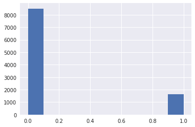
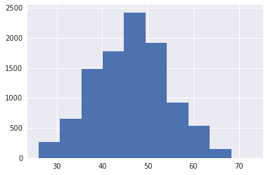
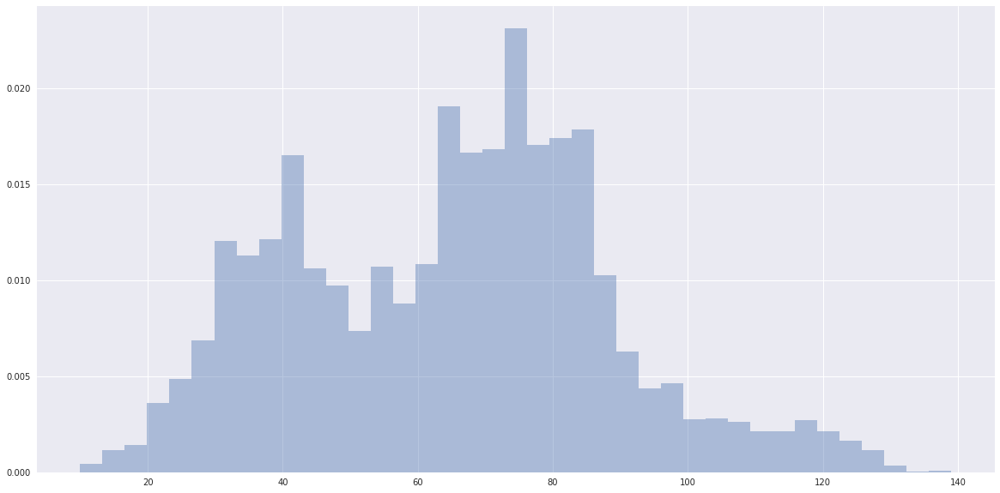
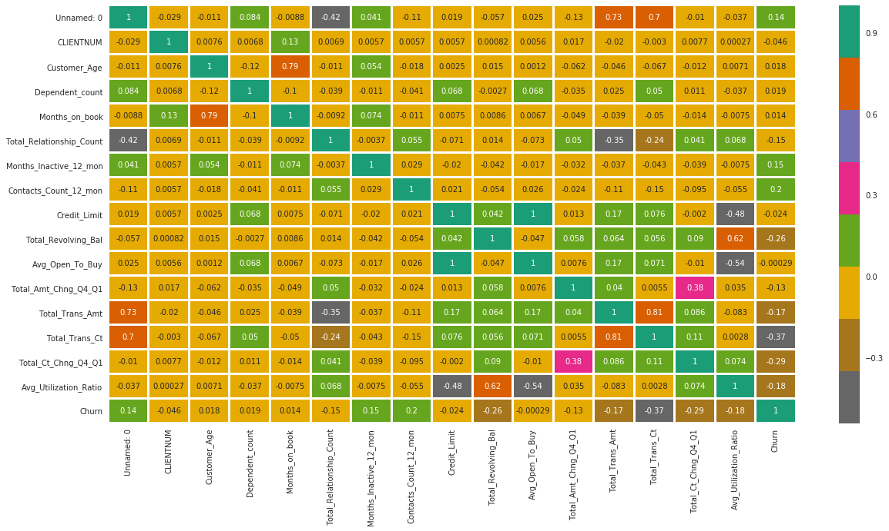

# mlvc

This Python library seeks easier machine learning steps to develop a production model for commercialization for example. 

It uses [scikit-learn](https://scikit-learn.org/stable/) as a machine learning library, [pandas](https://pandas.pydata.org/) for data analysis and manipulation tool, [seaborn](https://seaborn.pydata.org/) for data visualization as well and [gitpython](https://gitpython.readthedocs.io/en/stable/) for version control.

The idea to start working on this project was taken from the [udacity](https://www.udacity.com/)  nanodegree: Machine learning DevOps; a tool to ml production development [deployment environment](https://en.wikipedia.org/wiki/Deployment_environment). 

Therefore the framework architecture is based on three pillars in a Machine Learning pipeline:

- Modeling -> class MlModeling ->  It has the necessary methods for machine learning pipelines. It contains tasks necessary methods for EDA and pre-process stage, training & predicting. Also, produce graphical information from those as reports or plots.
- Control -> MlController -> Not implemented -> Idea: Act as controller on machine learning models, targeting better accuracy giving relaibility to what is being developed. 
- Versioning -> MlVersioning ->  Not implemented -> Idea: Act as a version control tool as Git is for any software. However, acting more precisely to machine learning. 
- Communication -> MlApis -> Not implemented -> Idea: Act as a plataform to expose easily the developed models in Rest APIs.
---

1. First you have to download it inside your project using git:


```python
import os
repository_url='https://github.com/lucchesi-rodrigo/mlvc.git'
os.system(f'git clone {repository_url}')
```

2. Install the logging library loguru:


```python
! pip install -U loguru
```


3. Import the library:


```python
from ml_version_controller.mlvc.create_ml_model import MlModel
```


4. Create an instance model and load the dataset to it:


```python
model= MlModel('test')

df= model.data_loading(
    df_path= './data/bank_data.csv'
)
```

    2022-03-11 02:01:40.558 | INFO     | ml_version_controller.mlvc.create_ml_model:data_loading:60 - SUCCESS -> data_loading(./data/bank_data.csv) -> MSG -> CSV file loaded successfully -> 


5. Start the EDA with some data frame statistics analysis:


```python
stats_data = model.data_analysis()
```

    2022-03-11 02:01:45.333 | INFO     | ml_version_controller.mlvc.create_ml_model:data_analysis:100 - SUCCESS -> data_analysis() -> MSG -> Data analysis calculated successfully ! -> OUTPUT -> stats_data shape: (10127, 22) .


```python
stats_data
```


    {'shape': (10127, 22), 'null_values': Unnamed: 0                  0
     CLIENTNUM                   0
     Attrition_Flag              0
     Customer_Age                0
     Gender                      0
     Dependent_count             0
     Education_Level             0
     Marital_Status              0
     Income_Category             0
     Card_Category               0
     Months_on_book              0
     Total_Relationship_Count    0
     Months_Inactive_12_mon      0
     Contacts_Count_12_mon       0
     Credit_Limit                0
     Total_Revolving_Bal         0
     Avg_Open_To_Buy             0
     Total_Amt_Chng_Q4_Q1        0
     Total_Trans_Amt             0
     Total_Trans_Ct              0
     Total_Ct_Chng_Q4_Q1         0
     Avg_Utilization_Ratio       0
     dtype: int64, 'numeric_stats': '{"Unnamed: 0":{"count":10127.0,"mean":5063.0,"std":2923.557422046,"min":0.0,"25%":2531.5,"50%":5063.0,"75%":7594.5,"max":10126.0},"CLIENTNUM":{"count":10127.0,"mean":739177606.3336625099,"std":36903783.4502311498,"min":708082083.0,"25%":713036770.5,"50%":717926358.0,"75%":773143533.0,"max":828343083.0},"Customer_Age":{"count":10127.0,"mean":46.3259603041,"std":8.0168140325,"min":26.0,"25%":41.0,"50%":46.0,"75%":52.0,"max":73.0},"Dependent_count":{"count":10127.0,"mean":2.3462032191,"std":1.2989083489,"min":0.0,"25%":1.0,"50%":2.0,"75%":3.0,"max":5.0},"Months_on_book":{"count":10127.0,"mean":35.9284092031,"std":7.9864163309,"min":13.0,"25%":31.0,"50%":36.0,"75%":40.0,"max":56.0},"Total_Relationship_Count":{"count":10127.0,"mean":3.8125802311,"std":1.5544078653,"min":1.0,"25%":3.0,"50%":4.0,"75%":5.0,"max":6.0},"Months_Inactive_12_mon":{"count":10127.0,"mean":2.3411671769,"std":1.0106223994,"min":0.0,"25%":2.0,"50%":2.0,"75%":3.0,"max":6.0},"Contacts_Count_12_mon":{"count":10127.0,"mean":2.4553174682,"std":1.1062251426,"min":0.0,"25%":2.0,"50%":2.0,"75%":3.0,"max":6.0},"Credit_Limit":{"count":10127.0,"mean":8631.953698035,"std":9088.7766502232,"min":1438.3,"25%":2555.0,"50%":4549.0,"75%":11067.5,"max":34516.0},"Total_Revolving_Bal":{"count":10127.0,"mean":1162.81406142,"std":814.9873352358,"min":0.0,"25%":359.0,"50%":1276.0,"75%":1784.0,"max":2517.0},"Avg_Open_To_Buy":{"count":10127.0,"mean":7469.139636615,"std":9090.6853236791,"min":3.0,"25%":1324.5,"50%":3474.0,"75%":9859.0,"max":34516.0},"Total_Amt_Chng_Q4_Q1":{"count":10127.0,"mean":0.7599406537,"std":0.2192067692,"min":0.0,"25%":0.631,"50%":0.736,"75%":0.859,"max":3.397},"Total_Trans_Amt":{"count":10127.0,"mean":4404.08630394,"std":3397.1292535571,"min":510.0,"25%":2155.5,"50%":3899.0,"75%":4741.0,"max":18484.0},"Total_Trans_Ct":{"count":10127.0,"mean":64.8586945788,"std":23.4725704492,"min":10.0,"25%":45.0,"50%":67.0,"75%":81.0,"max":139.0},"Total_Ct_Chng_Q4_Q1":{"count":10127.0,"mean":0.7122223758,"std":0.2380860913,"min":0.0,"25%":0.582,"50%":0.702,"75%":0.818,"max":3.714},"Avg_Utilization_Ratio":{"count":10127.0,"mean":0.2748935519,"std":0.2756914693,"min":0.0,"25%":0.023,"50%":0.176,"75%":0.503,"max":0.999}}'}


6. Isolate the categoric columns from the numeric ones to start working with the machine learning models:


```python
numeric_cols, categoric_cols = model.isolate_categ_and_num_cols()
```

    2022-03-09 02:04:10.526 | INFO     | ml_version_controller.mlvc.create_ml_model:isolate_categ_and_num_cols:143 - SUCCESS -> isolate_categ_and_num_cols() -> MSG -> Isolated df numeric and categoric columns ! -> OUTPUT -> numeric_cols: ['Unnamed: 0', 'CLIENTNUM', 'Customer_Age', 'Dependent_count', 'Months_on_book', 'Total_Relationship_Count', 'Months_Inactive_12_mon', 'Contacts_Count_12_mon', 'Credit_Limit', 'Total_Revolving_Bal', 'Avg_Open_To_Buy', 'Total_Amt_Chng_Q4_Q1', 'Total_Trans_Amt', 'Total_Trans_Ct', 'Total_Ct_Chng_Q4_Q1', 'Avg_Utilization_Ratio'] , categoric_cols: ['Attrition_Flag', 'Gender', 'Education_Level', 'Marital_Status', 'Income_Category', 'Card_Category'] .


```python
numeric_cols
```


    ['Unnamed: 0',
     'CLIENTNUM',
     'Customer_Age',
     'Dependent_count',
     'Months_on_book',
     'Total_Relationship_Count',
     'Months_Inactive_12_mon',
     'Contacts_Count_12_mon',
     'Credit_Limit',
     'Total_Revolving_Bal',
     'Avg_Open_To_Buy',
     'Total_Amt_Chng_Q4_Q1',
     'Total_Trans_Amt',
     'Total_Trans_Ct',
     'Total_Ct_Chng_Q4_Q1',
     'Avg_Utilization_Ratio']


```python
categoric_cols
```


    ['Attrition_Flag',
     'Gender',
     'Education_Level',
     'Marital_Status',
     'Income_Category',
     'Card_Category']


7. Binary encoder to any categorical column with two distinct classes on a pandas TimeSeries:


```python
model.data_categoric_to_binary(target_name='Churn',col_name='Attrition_Flag',base_value='Existing Customer')
model.df.head()
```

    2022-03-09 02:04:12.438 | INFO     | ml_version_controller.mlvc.create_ml_model:data_categoric_to_binary:357 - SUCCESS -> data_categoric_to_binary(target_name= Churn ,col_name= Attrition_Flag ,base_value= Existing Customer) -> MSG -> Dataframe pre-processed successfully ! -> OUTPUT -> df cols: Index(['Unnamed: 0', 'CLIENTNUM', 'Attrition_Flag', 'Customer_Age', 'Gender',
           'Dependent_count', 'Education_Level', 'Marital_Status',
           'Income_Category', 'Card_Category', 'Months_on_book',
           'Total_Relationship_Count', 'Months_Inactive_12_mon',
           'Contacts_Count_12_mon', 'Credit_Limit', 'Total_Revolving_Bal',
           'Avg_Open_To_Buy', 'Total_Amt_Chng_Q4_Q1', 'Total_Trans_Amt',
           'Total_Trans_Ct', 'Total_Ct_Chng_Q4_Q1', 'Avg_Utilization_Ratio',
           'Churn'],
          dtype='object') .


<div>
<style scoped>
    .dataframe tbody tr th:only-of-type {
        vertical-align: middle;
    }

    .dataframe tbody tr th {
        vertical-align: top;
    }

    .dataframe thead th {
        text-align: right;
    }
</style>
<table border="1" class="dataframe">
  <thead>
    <tr style="text-align: right;">
      <th></th>
      <th>Unnamed: 0</th>
      <th>CLIENTNUM</th>
      <th>Attrition_Flag</th>
      <th>Customer_Age</th>
      <th>Gender</th>
      <th>Dependent_count</th>
      <th>Education_Level</th>
      <th>Marital_Status</th>
      <th>Income_Category</th>
      <th>Card_Category</th>
      <th>...</th>
      <th>Contacts_Count_12_mon</th>
      <th>Credit_Limit</th>
      <th>Total_Revolving_Bal</th>
      <th>Avg_Open_To_Buy</th>
      <th>Total_Amt_Chng_Q4_Q1</th>
      <th>Total_Trans_Amt</th>
      <th>Total_Trans_Ct</th>
      <th>Total_Ct_Chng_Q4_Q1</th>
      <th>Avg_Utilization_Ratio</th>
      <th>Churn</th>
    </tr>
  </thead>
  <tbody>
    <tr>
      <th>0</th>
      <td>0</td>
      <td>768805383</td>
      <td>Existing Customer</td>
      <td>45</td>
      <td>M</td>
      <td>3</td>
      <td>High School</td>
      <td>Married</td>
      <td>$60K - $80K</td>
      <td>Blue</td>
      <td>...</td>
      <td>3</td>
      <td>12691.0</td>
      <td>777</td>
      <td>11914.0</td>
      <td>1.335</td>
      <td>1144</td>
      <td>42</td>
      <td>1.625</td>
      <td>0.061</td>
      <td>0</td>
    </tr>
    <tr>
      <th>1</th>
      <td>1</td>
      <td>818770008</td>
      <td>Existing Customer</td>
      <td>49</td>
      <td>F</td>
      <td>5</td>
      <td>Graduate</td>
      <td>Single</td>
      <td>Less than $40K</td>
      <td>Blue</td>
      <td>...</td>
      <td>2</td>
      <td>8256.0</td>
      <td>864</td>
      <td>7392.0</td>
      <td>1.541</td>
      <td>1291</td>
      <td>33</td>
      <td>3.714</td>
      <td>0.105</td>
      <td>0</td>
    </tr>
    <tr>
      <th>2</th>
      <td>2</td>
      <td>713982108</td>
      <td>Existing Customer</td>
      <td>51</td>
      <td>M</td>
      <td>3</td>
      <td>Graduate</td>
      <td>Married</td>
      <td>$80K - $120K</td>
      <td>Blue</td>
      <td>...</td>
      <td>0</td>
      <td>3418.0</td>
      <td>0</td>
      <td>3418.0</td>
      <td>2.594</td>
      <td>1887</td>
      <td>20</td>
      <td>2.333</td>
      <td>0.000</td>
      <td>0</td>
    </tr>
    <tr>
      <th>3</th>
      <td>3</td>
      <td>769911858</td>
      <td>Existing Customer</td>
      <td>40</td>
      <td>F</td>
      <td>4</td>
      <td>High School</td>
      <td>Unknown</td>
      <td>Less than $40K</td>
      <td>Blue</td>
      <td>...</td>
      <td>1</td>
      <td>3313.0</td>
      <td>2517</td>
      <td>796.0</td>
      <td>1.405</td>
      <td>1171</td>
      <td>20</td>
      <td>2.333</td>
      <td>0.760</td>
      <td>0</td>
    </tr>
    <tr>
      <th>4</th>
      <td>4</td>
      <td>709106358</td>
      <td>Existing Customer</td>
      <td>40</td>
      <td>M</td>
      <td>3</td>
      <td>Uneducated</td>
      <td>Married</td>
      <td>$60K - $80K</td>
      <td>Blue</td>
      <td>...</td>
      <td>0</td>
      <td>4716.0</td>
      <td>0</td>
      <td>4716.0</td>
      <td>2.175</td>
      <td>816</td>
      <td>28</td>
      <td>2.500</td>
      <td>0.000</td>
      <td>0</td>
    </tr>
  </tbody>
</table>
<p>5 rows × 23 columns</p>
</div>


8. That's where the EDA starts to shine with insights from data visualization: 


```python
model.data_hist_plot(col_name='Churn')
```

    2022-03-09 02:04:13.382 | INFO     | ml_version_controller.mlvc.create_ml_model:data_hist_plot:182 - SUCCESS -> data_hist_plot(col_name=Churn) -> MSG -> Dataframe histogram plot created ! -> 


    

    


```python
model.data_hist_plot(col_name= 'Customer_Age')
```

    2022-03-09 02:04:14.277 | INFO     | ml_version_controller.mlvc.create_ml_model:data_hist_plot:182 - SUCCESS -> data_hist_plot(col_name=Customer_Age) -> MSG -> Dataframe histogram plot created ! -> 


    

    


```python
model.normalized_data_plot(col_name='Marital_Status', plot_type='bar') 
```

    2022-03-09 02:04:15.413 | INFO     | ml_version_controller.mlvc.create_ml_model:normalized_data_plot:224 - SUCCESS -> normalized_data_plot(col_name=Marital_Status ,plot_type= bar) -> MSG -> Created Pandas series plot bar ! -> 


    

    


```python
model.data_dist_plot(col_name='Total_Trans_Ct')
```

    2022-03-09 02:04:16.200 | INFO     | ml_version_controller.mlvc.create_ml_model:data_dist_plot:260 - x:0         42
    1         33
    2         20
    3         20
    4         28
    5         24
    6         31
    7         36
    8         24
    9         32
    10        42
    11        26
    12        17
    13        33
    14        29
    15        27
    16        27
    17        21
    18        30
    19        21
    20        27
    21        16
    22        18
    23        23
    24        21
    25        22
    26        23
    27        40
    28        18
    29        38
            ... 
    10097    104
    10098     70
    10099     88
    10100    128
    10101     92
    10102    123
    10103     77
    10104     93
    10105     66
    10106    123
    10107     79
    10108     66
    10109    111
    10110    108
    10111    119
    10112     73
    10113     85
    10114     96
    10115    109
    10116    112
    10117    111
    10118     63
    10119     53
    10120    114
    10121    120
    10122    117
    10123     69
    10124     60
    10125     62
    10126     61
    Name: Total_Trans_Ct, Length: 10127, dtype: int64
    2022-03-09 02:04:16.291 | ERROR    | ml_version_controller.mlvc.create_ml_model:data_dist_plot:272 - ERROR  -> data_dist_plot(col_name=Total_Trans_Ct) -> MSG -> Could not create Pandas series dist plot ! ->Exception -> 'numpy.float64' object cannot be interpreted as an integer .


    

    


```python
model.data_heatmap_plot()
```


    

    


    2022-03-09 02:04:20.155 | INFO     | ml_version_controller.mlvc.create_ml_model:data_heatmap_plot:313 - SUCCESS -> data_heatmap_plot(color_pallette= Dark2_r) -> MSG -> Created heatmap plot ! -> 


9. Isolate the target function and necessary states to create the hypotheses space is the next goal. However, we need to deal with categorical data to machine learning algorithms. Encoding these columns will be done in the next steps:


```python
model.data_feature_encoder(
    col_name= 'Gender',
    target_col= 'Churn'
)
```

    2022-03-09 02:04:21.337 | INFO     | ml_version_controller.mlvc.create_ml_model:data_feature_encoder:404 - SUCCESS -> data_feature_encoder(col_name= Gender, target_col= Churn ) -> MSG -> Dataframe pre-processed successfully ! -> OUTPUT -> df cols: Index(['Unnamed: 0', 'CLIENTNUM', 'Attrition_Flag', 'Customer_Age', 'Gender',
           'Dependent_count', 'Education_Level', 'Marital_Status',
           'Income_Category', 'Card_Category', 'Months_on_book',
           'Total_Relationship_Count', 'Months_Inactive_12_mon',
           'Contacts_Count_12_mon', 'Credit_Limit', 'Total_Revolving_Bal',
           'Avg_Open_To_Buy', 'Total_Amt_Chng_Q4_Q1', 'Total_Trans_Amt',
           'Total_Trans_Ct', 'Total_Ct_Chng_Q4_Q1', 'Avg_Utilization_Ratio',
           'Churn', 'Gender_Churn'],
          dtype='object') ,df head: {"Unnamed: 0":{"0":0,"1":1,"2":2,"3":3,"4":4},"CLIENTNUM":{"0":768805383,"1":818770008,"2":713982108,"3":769911858,"4":709106358},"Attrition_Flag":{"0":"Existing Customer","1":"Existing Customer","2":"Existing Customer","3":"Existing Customer","4":"Existing Customer"},"Customer_Age":{"0":45,"1":49,"2":51,"3":40,"4":40},"Gender":{"0":"M","1":"F","2":"M","3":"F","4":"M"},"Dependent_count":{"0":3,"1":5,"2":3,"3":4,"4":3},"Education_Level":{"0":"High School","1":"Graduate","2":"Graduate","3":"High School","4":"Uneducated"},"Marital_Status":{"0":"Married","1":"Single","2":"Married","3":"Unknown","4":"Married"},"Income_Category":{"0":"$60K - $80K","1":"Less than $40K","2":"$80K - $120K","3":"Less than $40K","4":"$60K - $80K"},"Card_Category":{"0":"Blue","1":"Blue","2":"Blue","3":"Blue","4":"Blue"},"Months_on_book":{"0":39,"1":44,"2":36,"3":34,"4":21},"Total_Relationship_Count":{"0":5,"1":6,"2":4,"3":3,"4":5},"Months_Inactive_12_mon":{"0":1,"1":1,"2":1,"3":4,"4":1},"Contacts_Count_12_mon":{"0":3,"1":2,"2":0,"3":1,"4":0},"Credit_Limit":{"0":12691.0,"1":8256.0,"2":3418.0,"3":3313.0,"4":4716.0},"Total_Revolving_Bal":{"0":777,"1":864,"2":0,"3":2517,"4":0},"Avg_Open_To_Buy":{"0":11914.0,"1":7392.0,"2":3418.0,"3":796.0,"4":4716.0},"Total_Amt_Chng_Q4_Q1":{"0":1.335,"1":1.541,"2":2.594,"3":1.405,"4":2.175},"Total_Trans_Amt":{"0":1144,"1":1291,"2":1887,"3":1171,"4":816},"Total_Trans_Ct":{"0":42,"1":33,"2":20,"3":20,"4":28},"Total_Ct_Chng_Q4_Q1":{"0":1.625,"1":3.714,"2":2.333,"3":2.333,"4":2.5},"Avg_Utilization_Ratio":{"0":0.061,"1":0.105,"2":0.0,"3":0.76,"4":0.0},"Churn":{"0":0,"1":0,"2":0,"3":0,"4":0},"Gender_Churn":{"0":0.1461522332,"1":0.1735722284,"2":0.1461522332,"3":0.1735722284,"4":0.1461522332}} .


```python
model.data_feature_encoder(
    col_name= 'Education_Level',
    target_col= 'Churn'
)
```

    2022-03-09 02:04:22.410 | INFO     | ml_version_controller.mlvc.create_ml_model:data_feature_encoder:404 - SUCCESS -> data_feature_encoder(col_name= Education_Level, target_col= Churn ) -> MSG -> Dataframe pre-processed successfully ! -> OUTPUT -> df cols: Index(['Unnamed: 0', 'CLIENTNUM', 'Attrition_Flag', 'Customer_Age', 'Gender',
           'Dependent_count', 'Education_Level', 'Marital_Status',
           'Income_Category', 'Card_Category', 'Months_on_book',
           'Total_Relationship_Count', 'Months_Inactive_12_mon',
           'Contacts_Count_12_mon', 'Credit_Limit', 'Total_Revolving_Bal',
           'Avg_Open_To_Buy', 'Total_Amt_Chng_Q4_Q1', 'Total_Trans_Amt',
           'Total_Trans_Ct', 'Total_Ct_Chng_Q4_Q1', 'Avg_Utilization_Ratio',
           'Churn', 'Gender_Churn', 'Education_Level_Churn'],
          dtype='object') ,df head: {"Unnamed: 0":{"0":0,"1":1,"2":2,"3":3,"4":4},"CLIENTNUM":{"0":768805383,"1":818770008,"2":713982108,"3":769911858,"4":709106358},"Attrition_Flag":{"0":"Existing Customer","1":"Existing Customer","2":"Existing Customer","3":"Existing Customer","4":"Existing Customer"},"Customer_Age":{"0":45,"1":49,"2":51,"3":40,"4":40},"Gender":{"0":"M","1":"F","2":"M","3":"F","4":"M"},"Dependent_count":{"0":3,"1":5,"2":3,"3":4,"4":3},"Education_Level":{"0":"High School","1":"Graduate","2":"Graduate","3":"High School","4":"Uneducated"},"Marital_Status":{"0":"Married","1":"Single","2":"Married","3":"Unknown","4":"Married"},"Income_Category":{"0":"$60K - $80K","1":"Less than $40K","2":"$80K - $120K","3":"Less than $40K","4":"$60K - $80K"},"Card_Category":{"0":"Blue","1":"Blue","2":"Blue","3":"Blue","4":"Blue"},"Months_on_book":{"0":39,"1":44,"2":36,"3":34,"4":21},"Total_Relationship_Count":{"0":5,"1":6,"2":4,"3":3,"4":5},"Months_Inactive_12_mon":{"0":1,"1":1,"2":1,"3":4,"4":1},"Contacts_Count_12_mon":{"0":3,"1":2,"2":0,"3":1,"4":0},"Credit_Limit":{"0":12691.0,"1":8256.0,"2":3418.0,"3":3313.0,"4":4716.0},"Total_Revolving_Bal":{"0":777,"1":864,"2":0,"3":2517,"4":0},"Avg_Open_To_Buy":{"0":11914.0,"1":7392.0,"2":3418.0,"3":796.0,"4":4716.0},"Total_Amt_Chng_Q4_Q1":{"0":1.335,"1":1.541,"2":2.594,"3":1.405,"4":2.175},"Total_Trans_Amt":{"0":1144,"1":1291,"2":1887,"3":1171,"4":816},"Total_Trans_Ct":{"0":42,"1":33,"2":20,"3":20,"4":28},"Total_Ct_Chng_Q4_Q1":{"0":1.625,"1":3.714,"2":2.333,"3":2.333,"4":2.5},"Avg_Utilization_Ratio":{"0":0.061,"1":0.105,"2":0.0,"3":0.76,"4":0.0},"Churn":{"0":0,"1":0,"2":0,"3":0,"4":0},"Gender_Churn":{"0":0.1461522332,"1":0.1735722284,"2":0.1461522332,"3":0.1735722284,"4":0.1461522332},"Education_Level_Churn":{"0":0.1520119225,"1":0.1556905371,"2":0.1556905371,"3":0.1520119225,"4":0.1593813046}} .


```python
model.data_feature_encoder(
    col_name= 'Marital_Status',
    target_col= 'Churn'
)
```

    2022-03-09 02:04:23.615 | INFO     | ml_version_controller.mlvc.create_ml_model:data_feature_encoder:404 - SUCCESS -> data_feature_encoder(col_name= Marital_Status, target_col= Churn ) -> MSG -> Dataframe pre-processed successfully ! -> OUTPUT -> df cols: Index(['Unnamed: 0', 'CLIENTNUM', 'Attrition_Flag', 'Customer_Age', 'Gender',
           'Dependent_count', 'Education_Level', 'Marital_Status',
           'Income_Category', 'Card_Category', 'Months_on_book',
           'Total_Relationship_Count', 'Months_Inactive_12_mon',
           'Contacts_Count_12_mon', 'Credit_Limit', 'Total_Revolving_Bal',
           'Avg_Open_To_Buy', 'Total_Amt_Chng_Q4_Q1', 'Total_Trans_Amt',
           'Total_Trans_Ct', 'Total_Ct_Chng_Q4_Q1', 'Avg_Utilization_Ratio',
           'Churn', 'Gender_Churn', 'Education_Level_Churn',
           'Marital_Status_Churn'],
          dtype='object') ,df head: {"Unnamed: 0":{"0":0,"1":1,"2":2,"3":3,"4":4},"CLIENTNUM":{"0":768805383,"1":818770008,"2":713982108,"3":769911858,"4":709106358},"Attrition_Flag":{"0":"Existing Customer","1":"Existing Customer","2":"Existing Customer","3":"Existing Customer","4":"Existing Customer"},"Customer_Age":{"0":45,"1":49,"2":51,"3":40,"4":40},"Gender":{"0":"M","1":"F","2":"M","3":"F","4":"M"},"Dependent_count":{"0":3,"1":5,"2":3,"3":4,"4":3},"Education_Level":{"0":"High School","1":"Graduate","2":"Graduate","3":"High School","4":"Uneducated"},"Marital_Status":{"0":"Married","1":"Single","2":"Married","3":"Unknown","4":"Married"},"Income_Category":{"0":"$60K - $80K","1":"Less than $40K","2":"$80K - $120K","3":"Less than $40K","4":"$60K - $80K"},"Card_Category":{"0":"Blue","1":"Blue","2":"Blue","3":"Blue","4":"Blue"},"Months_on_book":{"0":39,"1":44,"2":36,"3":34,"4":21},"Total_Relationship_Count":{"0":5,"1":6,"2":4,"3":3,"4":5},"Months_Inactive_12_mon":{"0":1,"1":1,"2":1,"3":4,"4":1},"Contacts_Count_12_mon":{"0":3,"1":2,"2":0,"3":1,"4":0},"Credit_Limit":{"0":12691.0,"1":8256.0,"2":3418.0,"3":3313.0,"4":4716.0},"Total_Revolving_Bal":{"0":777,"1":864,"2":0,"3":2517,"4":0},"Avg_Open_To_Buy":{"0":11914.0,"1":7392.0,"2":3418.0,"3":796.0,"4":4716.0},"Total_Amt_Chng_Q4_Q1":{"0":1.335,"1":1.541,"2":2.594,"3":1.405,"4":2.175},"Total_Trans_Amt":{"0":1144,"1":1291,"2":1887,"3":1171,"4":816},"Total_Trans_Ct":{"0":42,"1":33,"2":20,"3":20,"4":28},"Total_Ct_Chng_Q4_Q1":{"0":1.625,"1":3.714,"2":2.333,"3":2.333,"4":2.5},"Avg_Utilization_Ratio":{"0":0.061,"1":0.105,"2":0.0,"3":0.76,"4":0.0},"Churn":{"0":0,"1":0,"2":0,"3":0,"4":0},"Gender_Churn":{"0":0.1461522332,"1":0.1735722284,"2":0.1461522332,"3":0.1735722284,"4":0.1461522332},"Education_Level_Churn":{"0":0.1520119225,"1":0.1556905371,"2":0.1556905371,"3":0.1520119225,"4":0.1593813046},"Marital_Status_Churn":{"0":0.1512694687,"1":0.1694141517,"2":0.1512694687,"3":0.1722296395,"4":0.1512694687}} .


```python
model.data_feature_encoder(
    col_name= 'Income_Category',
    target_col= 'Churn'
)
```

    2022-03-09 02:04:24.643 | INFO     | ml_version_controller.mlvc.create_ml_model:data_feature_encoder:404 - SUCCESS -> data_feature_encoder(col_name= Income_Category, target_col= Churn ) -> MSG -> Dataframe pre-processed successfully ! -> OUTPUT -> df cols: Index(['Unnamed: 0', 'CLIENTNUM', 'Attrition_Flag', 'Customer_Age', 'Gender',
           'Dependent_count', 'Education_Level', 'Marital_Status',
           'Income_Category', 'Card_Category', 'Months_on_book',
           'Total_Relationship_Count', 'Months_Inactive_12_mon',
           'Contacts_Count_12_mon', 'Credit_Limit', 'Total_Revolving_Bal',
           'Avg_Open_To_Buy', 'Total_Amt_Chng_Q4_Q1', 'Total_Trans_Amt',
           'Total_Trans_Ct', 'Total_Ct_Chng_Q4_Q1', 'Avg_Utilization_Ratio',
           'Churn', 'Gender_Churn', 'Education_Level_Churn',
           'Marital_Status_Churn', 'Income_Category_Churn'],
          dtype='object') ,df head: {"Unnamed: 0":{"0":0,"1":1,"2":2,"3":3,"4":4},"CLIENTNUM":{"0":768805383,"1":818770008,"2":713982108,"3":769911858,"4":709106358},"Attrition_Flag":{"0":"Existing Customer","1":"Existing Customer","2":"Existing Customer","3":"Existing Customer","4":"Existing Customer"},"Customer_Age":{"0":45,"1":49,"2":51,"3":40,"4":40},"Gender":{"0":"M","1":"F","2":"M","3":"F","4":"M"},"Dependent_count":{"0":3,"1":5,"2":3,"3":4,"4":3},"Education_Level":{"0":"High School","1":"Graduate","2":"Graduate","3":"High School","4":"Uneducated"},"Marital_Status":{"0":"Married","1":"Single","2":"Married","3":"Unknown","4":"Married"},"Income_Category":{"0":"$60K - $80K","1":"Less than $40K","2":"$80K - $120K","3":"Less than $40K","4":"$60K - $80K"},"Card_Category":{"0":"Blue","1":"Blue","2":"Blue","3":"Blue","4":"Blue"},"Months_on_book":{"0":39,"1":44,"2":36,"3":34,"4":21},"Total_Relationship_Count":{"0":5,"1":6,"2":4,"3":3,"4":5},"Months_Inactive_12_mon":{"0":1,"1":1,"2":1,"3":4,"4":1},"Contacts_Count_12_mon":{"0":3,"1":2,"2":0,"3":1,"4":0},"Credit_Limit":{"0":12691.0,"1":8256.0,"2":3418.0,"3":3313.0,"4":4716.0},"Total_Revolving_Bal":{"0":777,"1":864,"2":0,"3":2517,"4":0},"Avg_Open_To_Buy":{"0":11914.0,"1":7392.0,"2":3418.0,"3":796.0,"4":4716.0},"Total_Amt_Chng_Q4_Q1":{"0":1.335,"1":1.541,"2":2.594,"3":1.405,"4":2.175},"Total_Trans_Amt":{"0":1144,"1":1291,"2":1887,"3":1171,"4":816},"Total_Trans_Ct":{"0":42,"1":33,"2":20,"3":20,"4":28},"Total_Ct_Chng_Q4_Q1":{"0":1.625,"1":3.714,"2":2.333,"3":2.333,"4":2.5},"Avg_Utilization_Ratio":{"0":0.061,"1":0.105,"2":0.0,"3":0.76,"4":0.0},"Churn":{"0":0,"1":0,"2":0,"3":0,"4":0},"Gender_Churn":{"0":0.1461522332,"1":0.1735722284,"2":0.1461522332,"3":0.1735722284,"4":0.1461522332},"Education_Level_Churn":{"0":0.1520119225,"1":0.1556905371,"2":0.1556905371,"3":0.1520119225,"4":0.1593813046},"Marital_Status_Churn":{"0":0.1512694687,"1":0.1694141517,"2":0.1512694687,"3":0.1722296395,"4":0.1512694687},"Income_Category_Churn":{"0":0.134807418,"1":0.1718618366,"2":0.1576547231,"3":0.1718618366,"4":0.134807418}} .


```python
model.data_feature_encoder(
    col_name= 'Card_Category',
    target_col= 'Churn'
)
```

    2022-03-09 02:04:25.623 | INFO     | ml_version_controller.mlvc.create_ml_model:data_feature_encoder:404 - SUCCESS -> data_feature_encoder(col_name= Card_Category, target_col= Churn ) -> MSG -> Dataframe pre-processed successfully ! -> OUTPUT -> df cols: Index(['Unnamed: 0', 'CLIENTNUM', 'Attrition_Flag', 'Customer_Age', 'Gender',
           'Dependent_count', 'Education_Level', 'Marital_Status',
           'Income_Category', 'Card_Category', 'Months_on_book',
           'Total_Relationship_Count', 'Months_Inactive_12_mon',
           'Contacts_Count_12_mon', 'Credit_Limit', 'Total_Revolving_Bal',
           'Avg_Open_To_Buy', 'Total_Amt_Chng_Q4_Q1', 'Total_Trans_Amt',
           'Total_Trans_Ct', 'Total_Ct_Chng_Q4_Q1', 'Avg_Utilization_Ratio',
           'Churn', 'Gender_Churn', 'Education_Level_Churn',
           'Marital_Status_Churn', 'Income_Category_Churn', 'Card_Category_Churn'],
          dtype='object') ,df head: {"Unnamed: 0":{"0":0,"1":1,"2":2,"3":3,"4":4},"CLIENTNUM":{"0":768805383,"1":818770008,"2":713982108,"3":769911858,"4":709106358},"Attrition_Flag":{"0":"Existing Customer","1":"Existing Customer","2":"Existing Customer","3":"Existing Customer","4":"Existing Customer"},"Customer_Age":{"0":45,"1":49,"2":51,"3":40,"4":40},"Gender":{"0":"M","1":"F","2":"M","3":"F","4":"M"},"Dependent_count":{"0":3,"1":5,"2":3,"3":4,"4":3},"Education_Level":{"0":"High School","1":"Graduate","2":"Graduate","3":"High School","4":"Uneducated"},"Marital_Status":{"0":"Married","1":"Single","2":"Married","3":"Unknown","4":"Married"},"Income_Category":{"0":"$60K - $80K","1":"Less than $40K","2":"$80K - $120K","3":"Less than $40K","4":"$60K - $80K"},"Card_Category":{"0":"Blue","1":"Blue","2":"Blue","3":"Blue","4":"Blue"},"Months_on_book":{"0":39,"1":44,"2":36,"3":34,"4":21},"Total_Relationship_Count":{"0":5,"1":6,"2":4,"3":3,"4":5},"Months_Inactive_12_mon":{"0":1,"1":1,"2":1,"3":4,"4":1},"Contacts_Count_12_mon":{"0":3,"1":2,"2":0,"3":1,"4":0},"Credit_Limit":{"0":12691.0,"1":8256.0,"2":3418.0,"3":3313.0,"4":4716.0},"Total_Revolving_Bal":{"0":777,"1":864,"2":0,"3":2517,"4":0},"Avg_Open_To_Buy":{"0":11914.0,"1":7392.0,"2":3418.0,"3":796.0,"4":4716.0},"Total_Amt_Chng_Q4_Q1":{"0":1.335,"1":1.541,"2":2.594,"3":1.405,"4":2.175},"Total_Trans_Amt":{"0":1144,"1":1291,"2":1887,"3":1171,"4":816},"Total_Trans_Ct":{"0":42,"1":33,"2":20,"3":20,"4":28},"Total_Ct_Chng_Q4_Q1":{"0":1.625,"1":3.714,"2":2.333,"3":2.333,"4":2.5},"Avg_Utilization_Ratio":{"0":0.061,"1":0.105,"2":0.0,"3":0.76,"4":0.0},"Churn":{"0":0,"1":0,"2":0,"3":0,"4":0},"Gender_Churn":{"0":0.1461522332,"1":0.1735722284,"2":0.1461522332,"3":0.1735722284,"4":0.1461522332},"Education_Level_Churn":{"0":0.1520119225,"1":0.1556905371,"2":0.1556905371,"3":0.1520119225,"4":0.1593813046},"Marital_Status_Churn":{"0":0.1512694687,"1":0.1694141517,"2":0.1512694687,"3":0.1722296395,"4":0.1512694687},"Income_Category_Churn":{"0":0.134807418,"1":0.1718618366,"2":0.1576547231,"3":0.1718618366,"4":0.134807418},"Card_Category_Churn":{"0":0.1609792285,"1":0.1609792285,"2":0.1609792285,"3":0.1609792285,"4":0.1609792285}} .


10. Right, here the fun starts up. 


```python
X_COLLUMNS = ['Customer_Age', 'Dependent_count', 'Months_on_book',
             'Total_Relationship_Count', 'Months_Inactive_12_mon',
             'Contacts_Count_12_mon', 'Credit_Limit', 'Total_Revolving_Bal',
             'Avg_Open_To_Buy', 'Total_Amt_Chng_Q4_Q1', 'Total_Trans_Amt',
             'Total_Trans_Ct', 'Total_Ct_Chng_Q4_Q1', 'Avg_Utilization_Ratio',
             'Gender_Churn', 'Education_Level_Churn', 'Marital_Status_Churn', 
             'Income_Category_Churn', 'Card_Category_Churn']

ml_matrix= model.data_build_ml_matrix(
    target_col= 'Churn', 
    states_key= X_COLLUMNS
)
```

    2022-03-09 02:04:26.229 | INFO     | ml_version_controller.mlvc.create_ml_model:data_build_ml_matrix:443 - SUCCESS -> data_build_ml_matrix(target_col= Churn, states_key= ['Customer_Age', 'Dependent_count', 'Months_on_book', 'Total_Relationship_Count', 'Months_Inactive_12_mon', 'Contacts_Count_12_mon', 'Credit_Limit', 'Total_Revolving_Bal', 'Avg_Open_To_Buy', 'Total_Amt_Chng_Q4_Q1', 'Total_Trans_Amt', 'Total_Trans_Ct', 'Total_Ct_Chng_Q4_Q1', 'Avg_Utilization_Ratio', 'Gender_Churn', 'Education_Level_Churn', 'Marital_Status_Churn', 'Income_Category_Churn', 'Card_Category_Churn']) -> MSG -> Machine learning matrix is created ! -> OUTPUT -> y: [0, 0, 0, 0, 0, 0, 0, 0, 0, 0] , 
    X columns: {"Customer_Age":{"0":45,"1":49,"2":51,"3":40,"4":40},"Dependent_count":{"0":3,"1":5,"2":3,"3":4,"4":3},"Months_on_book":{"0":39,"1":44,"2":36,"3":34,"4":21},"Total_Relationship_Count":{"0":5,"1":6,"2":4,"3":3,"4":5},"Months_Inactive_12_mon":{"0":1,"1":1,"2":1,"3":4,"4":1},"Contacts_Count_12_mon":{"0":3,"1":2,"2":0,"3":1,"4":0},"Credit_Limit":{"0":12691.0,"1":8256.0,"2":3418.0,"3":3313.0,"4":4716.0},"Total_Revolving_Bal":{"0":777,"1":864,"2":0,"3":2517,"4":0},"Avg_Open_To_Buy":{"0":11914.0,"1":7392.0,"2":3418.0,"3":796.0,"4":4716.0},"Total_Amt_Chng_Q4_Q1":{"0":1.335,"1":1.541,"2":2.594,"3":1.405,"4":2.175},"Total_Trans_Amt":{"0":1144,"1":1291,"2":1887,"3":1171,"4":816},"Total_Trans_Ct":{"0":42,"1":33,"2":20,"3":20,"4":28},"Total_Ct_Chng_Q4_Q1":{"0":1.625,"1":3.714,"2":2.333,"3":2.333,"4":2.5},"Avg_Utilization_Ratio":{"0":0.061,"1":0.105,"2":0.0,"3":0.76,"4":0.0},"Gender_Churn":{"0":0.1461522332,"1":0.1735722284,"2":0.1461522332,"3":0.1735722284,"4":0.1461522332},"Education_Level_Churn":{"0":0.1520119225,"1":0.1556905371,"2":0.1556905371,"3":0.1520119225,"4":0.1593813046},"Marital_Status_Churn":{"0":0.1512694687,"1":0.1694141517,"2":0.1512694687,"3":0.1722296395,"4":0.1512694687},"Income_Category_Churn":{"0":0.134807418,"1":0.1718618366,"2":0.1576547231,"3":0.1718618366,"4":0.134807418},"Card_Category_Churn":{"0":0.1609792285,"1":0.1609792285,"2":0.1609792285,"3":0.1609792285,"4":0.1609792285}} .


11. Splitting test and training data is mandatory to validate the model:


```python
model.split_test_train_data(test_size =0.3, random_state=11)
```

    2022-03-09 02:04:26.986 | INFO     | ml_version_controller.mlvc.create_ml_model:split_test_train_data:490 - SUCCESS -> split_test_train_data(test_size= 0.3 ,random_state= 11 ) -> MSG -> Train and test data created ! -> OUTPUT 
    -> X_train: {"Customer_Age":{"9363":57,"1972":58},"Dependent_count":{"9363":3,"1972":0},"Months_on_book":{"9363":51,"1972":42},"Total_Relationship_Count":{"9363":1,"1972":3},"Months_Inactive_12_mon":{"9363":6,"1972":2},"Contacts_Count_12_mon":{"9363":1,"1972":3},"Credit_Limit":{"9363":5859.0,"1972":1438.3},"Total_Revolving_Bal":{"9363":0,"1972":0},"Avg_Open_To_Buy":{"9363":5859.0,"1972":1438.3},"Total_Amt_Chng_Q4_Q1":{"9363":0.914,"1972":0.835},"Total_Trans_Amt":{"9363":8004,"1972":1088},"Total_Trans_Ct":{"9363":82,"1972":22},"Total_Ct_Chng_Q4_Q1":{"9363":0.708,"1972":1.444},"Avg_Utilization_Ratio":{"9363":0.0,"1972":0.0},"Gender_Churn":{"9363":0.1461522332,"1972":0.1461522332},"Education_Level_Churn":{"9363":0.1685319289,"1972":0.1520119225},"Marital_Status_Churn":{"9363":0.1694141517,"1972":0.1722296395},"Income_Category_Churn":{"9363":0.134807418,"1972":0.151396648},"Card_Category_Churn":{"9363":0.1609792285,"1972":0.1609792285}} 
    -> X_test: {"Customer_Age":{"6046":50,"7265":46},"Dependent_count":{"6046":2,"7265":3},"Months_on_book":{"6046":37,"7265":29},"Total_Relationship_Count":{"6046":6,"7265":5},"Months_Inactive_12_mon":{"6046":3,"7265":1},"Contacts_Count_12_mon":{"6046":2,"7265":1},"Credit_Limit":{"6046":18085.0,"7265":2228.0},"Total_Revolving_Bal":{"6046":747,"7265":1449},"Avg_Open_To_Buy":{"6046":17338.0,"7265":779.0},"Total_Amt_Chng_Q4_Q1":{"6046":0.681,"7265":0.61},"Total_Trans_Amt":{"6046":4583,"7265":4382},"Total_Trans_Ct":{"6046":76,"7265":83},"Total_Ct_Chng_Q4_Q1":{"6046":0.52,"7265":0.694},"Avg_Utilization_Ratio":{"6046":0.041,"7265":0.65},"Gender_Churn":{"6046":0.1461522332,"7265":0.1735722284},"Education_Level_Churn":{"6046":0.1685319289,"7265":0.1593813046},"Marital_Status_Churn":{"6046":0.1512694687,"7265":0.1512694687},"Income_Category_Churn":{"6046":0.134807418,"7265":0.1718618366},"Card_Category_Churn":{"6046":0.1609792285,"7265":0.1609792285}} 
    -> y_train: {"9363":1,"1972":1} 
    -> y_test: {"6046":0,"7265":0}


12. OK! We have a supervised learning problem for a classification task, let's try some classifiers to be sure which will be used to our estimations: 


```python
from sklearn.linear_model import LogisticRegression
from sklearn.ensemble import RandomForestClassifier
```

13. Let's fit the LogisticRegression and predict some results. You can find more information about this algorithm [here](https://scikit-learn.org/stable/modules/generated/sklearn.linear_model.LogisticRegression.html):


```python
model_1 = model.fit_predict(
    model_name= 'lrc',
    model_algorithm=LogisticRegression()
)
```


```python
model_1
```

14. Let's store this model information, load it and check the performance of this algorithm:


```python
model.saving(model_1)
```


```python
model_1 = model.loading('./models/lrc_2022-03-09-01-19')
```


```python
model.clf_report(model_data=model_1)
```

15. What about trying more sophisticated algorithms ... RandomForest is a powerful architecture to combine multiple decision trees in a way called the ensemble method:


```python
model_2 = model.fit_predict_to_best_estimator(
        model_name= 'rfc',
        model_algorithm = RandomForestClassifier(),
        param_grid= { 
            'n_estimators': [200, 500],
            'max_features': ['auto', 'sqrt'],
            'max_depth' : [4,5,100],
            'criterion' :['gini', 'entropy']
        },
        folds= 5,
    )
```


```python
model_2
```


```python
model.saving(model_2)
```


```python
model_2 = model.loading('./models/rfc_2022-03-09-01-19')
```


```python
model.clf_report(model_data=model_2)
```

15. That's the confusion part : ) ... True positives rate points to how our model is accurate in its estimations:


```python
model.tp_rate_analysis(ml_models=[(model_1,False),(model_2,True)])
```

16. Feature importance calculations avoid model overfitting. This is dimensionality reduction, which helps in turning the calculations way faster. Machine learning is purely linear and non-linear algebra. Also, mathematical optimization to find the best results to fit the matrix in a single function.  Don't confuse yourself: An optimal dataset is not large in width but in height. Think about it: Do we need all the variables inside a room to estimate the comfort zones or do we need more measurements to find the real model or mix of both?


```python
model.feature_importance_plot_2(model_data=model_2)
```

Finally ...
