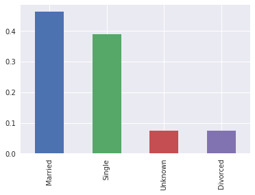
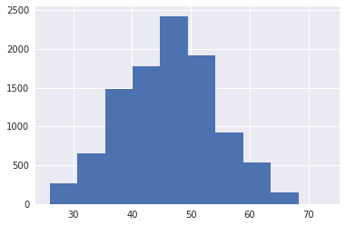
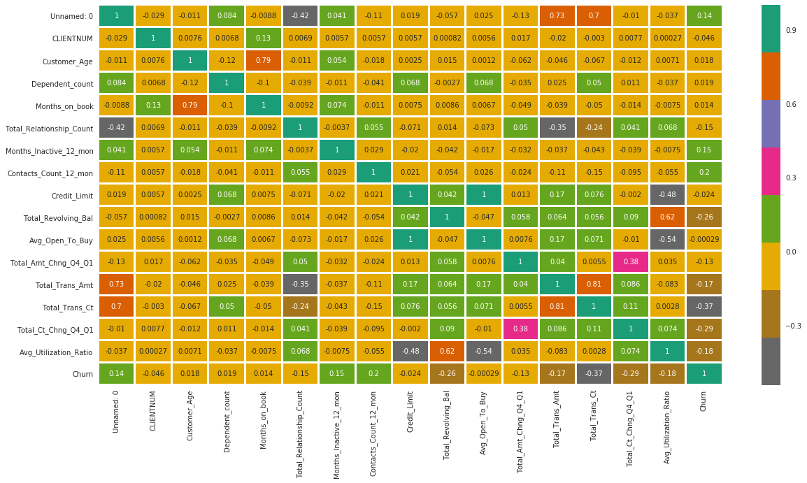
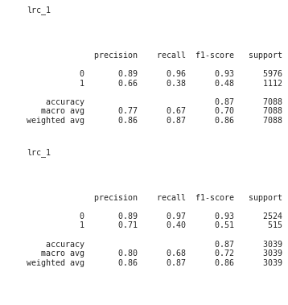
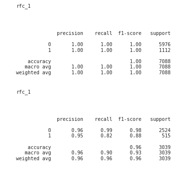
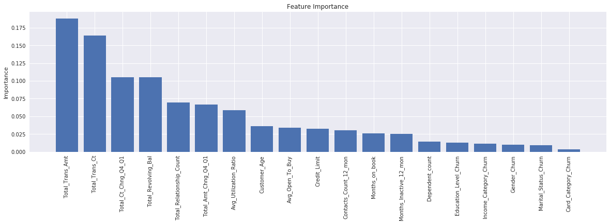
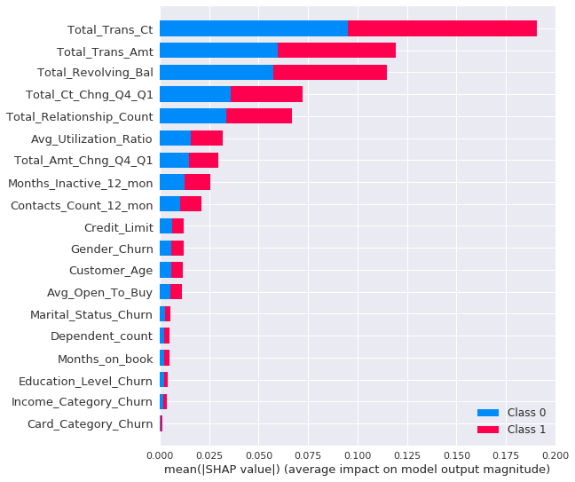
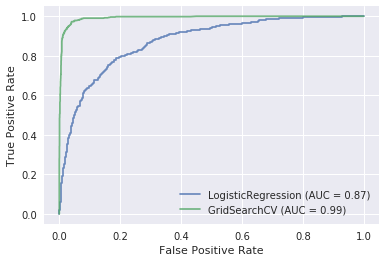
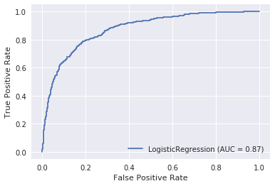

# mlvc

This Python library seeks easier machine learning steps to develop a production model for commercialization for example. 

It uses [scikit-learn](https://scikit-learn.org/stable/) as a machine learning library, [pandas](https://pandas.pydata.org/) for data analysis and manipulation tool, [seaborn](https://seaborn.pydata.org/) for data visualization as well and [gitpython](https://gitpython.readthedocs.io/en/stable/) for version control.

The idea to start working on this project was taken from the [udacity](https://www.udacity.com/)  nanodegree: Machine learning DevOps; a tool to ml production development [deployment environment](https://en.wikipedia.org/wiki/Deployment_environment). 

Therefore the framework architecture is based on three pillars in a Machine Learning pipeline:

- Modeling -> class MlModeling ->  It has the necessary methods for machine learning pipelines. It contains tasks necessary methods for EDA and pre-process stage, training & predicting. Also, produce graphical information from those as reports or plots.
- Control -> MlController -> Not implemented -> Idea: Act as controller on machine learning models, targeting better accuracy giving relaibility to what is being developed. 
- Versioning -> MlVersioning ->  Not implemented -> Idea: Act as a version control tool as Git is for any software. However, acting more precisely to machine learning. 
- Communication -> MlApis -> Not implemented -> Idea: Act as a plataform to expose easily the developed models in Rest APIs.
---
## System design:


---

1. First you have to download it inside your project using git:


```python
import os
repository_url='https://github.com/lucchesi-rodrigo/mlvc.git'
os.system(f'git clone {repository_url}')
```

---
2. Install the logging library loguru:


```python
! pip install -U loguru
```

---
3. That's fixing for shap TreeExplainer error [Fix reference](https://www.pythonpool.com/solved-importerror-numpy-core-multiarray-failed-to-import/):


```python
! pip install shap=="0.39"
```

```python
! pip install numpy=="1.19"
```

---
3. Import the library class responsible for modeling:


```python
from mlvc.mlvc.modeling import MlModeling
```

---
4. Create an instance model and load the dataset to it:


```python
from sklearn.linear_model import LogisticRegression

mlm_1 = MlModeling(
    model_name='lrc_1',
    model_algorithm=LogisticRegression(),
    model_version='0.1' 
)

mlm_1.data_loading(
    df_path='./data/bank_data.csv'
)
```

    2022-03-19 16:37:14.190 | INFO     | mlvc.mlvc.modeling:data_loading:82 - [SUCCESS -> data_loading(./data/bank_data.csv)] -> MSG -> data_loading starting process !
    2022-03-19 16:37:14.253 | INFO     | mlvc.mlvc.modeling:data_loading:88 - [SUCCESS -> data_loading(./data/bank_data.csv)] -> MSG -> data_loading finished process ! -> OUTPUT -> df sample: {"Unnamed: 0":{"0":0,"1":1},"CLIENTNUM":{"0":768805383,"1":818770008},"Attrition_Flag":{"0":"Existing Customer","1":"Existing Customer"},"Customer_Age":{"0":45,"1":49},"Gender":{"0":"M","1":"F"},"Dependent_count":{"0":3,"1":5},"Education_Level":{"0":"High School","1":"Graduate"},"Marital_Status":{"0":"Married","1":"Single"},"Income_Category":{"0":"$60K - $80K","1":"Less than $40K"},"Card_Category":{"0":"Blue","1":"Blue"},"Months_on_book":{"0":39,"1":44},"Total_Relationship_Count":{"0":5,"1":6},"Months_Inactive_12_mon":{"0":1,"1":1},"Contacts_Count_12_mon":{"0":3,"1":2},"Credit_Limit":{"0":12691.0,"1":8256.0},"Total_Revolving_Bal":{"0":777,"1":864},"Avg_Open_To_Buy":{"0":11914.0,"1":7392.0},"Total_Amt_Chng_Q4_Q1":{"0":1.335,"1":1.541},"Total_Trans_Amt":{"0":1144,"1":1291},"Total_Trans_Ct":{"0":42,"1":33},"Total_Ct_Chng_Q4_Q1":{"0":1.625,"1":3.714},"Avg_Utilization_Ratio":{"0":0.061,"1":0.105}}


---
5. Start the EDA with some data frame statistics analysis:


```python
stats_data = mlm_1.data_analysis()
```

    2022-03-19 16:37:16.234 | INFO     | mlvc.mlvc.modeling:data_analysis:124 - [SUCCESS -> data_analysis()] -> MSG -> Data analysis starting process ! -> 
    2022-03-19 16:37:16.309 | INFO     | mlvc.mlvc.modeling:data_analysis:135 - [SUCCESS -> data_analysis()] -> MSG -> Data analysis finished process ! -> OUTPUT -> stats_data numeric_stats: {"Unnamed: 0":{"count":10127.0,"mean":5063.0,"std":2923.557422046,"min":0.0,"25%":2531.5,"50%":5063.0,"75%":7594.5,"max":10126.0},"CLIENTNUM":{"count":10127.0,"mean":739177606.3336625099,"std":36903783.4502311498,"min":708082083.0,"25%":713036770.5,"50%":717926358.0,"75%":773143533.0,"max":828343083.0},"Customer_Age":{"count":10127.0,"mean":46.3259603041,"std":8.0168140325,"min":26.0,"25%":41.0,"50%":46.0,"75%":52.0,"max":73.0},"Dependent_count":{"count":10127.0,"mean":2.3462032191,"std":1.2989083489,"min":0.0,"25%":1.0,"50%":2.0,"75%":3.0,"max":5.0},"Months_on_book":{"count":10127.0,"mean":35.9284092031,"std":7.9864163309,"min":13.0,"25%":31.0,"50%":36.0,"75%":40.0,"max":56.0},"Total_Relationship_Count":{"count":10127.0,"mean":3.8125802311,"std":1.5544078653,"min":1.0,"25%":3.0,"50%":4.0,"75%":5.0,"max":6.0},"Months_Inactive_12_mon":{"count":10127.0,"mean":2.3411671769,"std":1.0106223994,"min":0.0,"25%":2.0,"50%":2.0,"75%":3.0,"max":6.0},"Contacts_Count_12_mon":{"count":10127.0,"mean":2.4553174682,"std":1.1062251426,"min":0.0,"25%":2.0,"50%":2.0,"75%":3.0,"max":6.0},"Credit_Limit":{"count":10127.0,"mean":8631.953698035,"std":9088.7766502232,"min":1438.3,"25%":2555.0,"50%":4549.0,"75%":11067.5,"max":34516.0},"Total_Revolving_Bal":{"count":10127.0,"mean":1162.81406142,"std":814.9873352358,"min":0.0,"25%":359.0,"50%":1276.0,"75%":1784.0,"max":2517.0},"Avg_Open_To_Buy":{"count":10127.0,"mean":7469.139636615,"std":9090.6853236791,"min":3.0,"25%":1324.5,"50%":3474.0,"75%":9859.0,"max":34516.0},"Total_Amt_Chng_Q4_Q1":{"count":10127.0,"mean":0.7599406537,"std":0.2192067692,"min":0.0,"25%":0.631,"50%":0.736,"75%":0.859,"max":3.397},"Total_Trans_Amt":{"count":10127.0,"mean":4404.08630394,"std":3397.1292535571,"min":510.0,"25%":2155.5,"50%":3899.0,"75%":4741.0,"max":18484.0},"Total_Trans_Ct":{"count":10127.0,"mean":64.8586945788,"std":23.4725704492,"min":10.0,"25%":45.0,"50%":67.0,"75%":81.0,"max":139.0},"Total_Ct_Chng_Q4_Q1":{"count":10127.0,"mean":0.7122223758,"std":0.2380860913,"min":0.0,"25%":0.582,"50%":0.702,"75%":0.818,"max":3.714},"Avg_Utilization_Ratio":{"count":10127.0,"mean":0.2748935519,"std":0.2756914693,"min":0.0,"25%":0.023,"50%":0.176,"75%":0.503,"max":0.999}} !


---
6. Isolate the categoric columns from the numeric ones to start working with the machine learning models:


```python
numeric_cols, categoric_cols = mlm_1.isolate_categ_and_num_cols()
```

    2022-03-19 16:37:17.420 | INFO     | mlvc.mlvc.modeling:isolate_categ_and_num_cols:175 - [SUCCESS -> isolate_categ_and_num_cols()] -> MSG -> isolate_categ_and_num_cols starting process ! -> 
    2022-03-19 16:37:17.423 | INFO     | mlvc.mlvc.modeling:isolate_categ_and_num_cols:183 - [SUCCESS -> isolate_categ_and_num_cols()] -> MSG -> Data analysis finished process ! -> OUTPUT -> numeric_cols: ['Unnamed: 0', 'CLIENTNUM', 'Customer_Age', 'Dependent_count', 'Months_on_book', 'Total_Relationship_Count', 'Months_Inactive_12_mon', 'Contacts_Count_12_mon', 'Credit_Limit', 'Total_Revolving_Bal', 'Avg_Open_To_Buy', 'Total_Amt_Chng_Q4_Q1', 'Total_Trans_Amt', 'Total_Trans_Ct', 'Total_Ct_Chng_Q4_Q1', 'Avg_Utilization_Ratio'], categoric_cols: ['Attrition_Flag', 'Gender', 'Education_Level', 'Marital_Status', 'Income_Category', 'Card_Category']!


```python
numeric_cols
```


    ['Unnamed: 0',
     'CLIENTNUM',
     'Customer_Age',
     'Dependent_count',
     'Months_on_book',
     'Total_Relationship_Count',
     'Months_Inactive_12_mon',
     'Contacts_Count_12_mon',
     'Credit_Limit',
     'Total_Revolving_Bal',
     'Avg_Open_To_Buy',
     'Total_Amt_Chng_Q4_Q1',
     'Total_Trans_Amt',
     'Total_Trans_Ct',
     'Total_Ct_Chng_Q4_Q1',
     'Avg_Utilization_Ratio']


```python
categoric_cols
```


    ['Attrition_Flag',
     'Gender',
     'Education_Level',
     'Marital_Status',
     'Income_Category',
     'Card_Category']


---
7. Binary encoder to any categorical column with two distinct classes on a pandas TimeSeries:


```python
df = mlm_1.data_categoric_to_binary(target_name='Churn',col_name='Attrition_Flag',base_value='Existing Customer')
```

    2022-03-19 16:37:20.510 | INFO     | mlvc.mlvc.modeling:data_categoric_to_binary:419 - [SUCCESS -> data_categoric_to_binary(target_name=Churn,col_name=Attrition_Flag,base_value=Existing Customer)] -> MSG -> data_categoric_to_binary starting process ! -> 
    2022-03-19 16:37:20.527 | INFO     | mlvc.mlvc.modeling:data_categoric_to_binary:426 - [SUCCESS -> data_categoric_to_binary(target_name=Churn,col_name=Attrition_Flag,base_value=Existing Customer) ] -> MSG -> data_categoric_to_binary finishing process ! -> OUTPUT -> data sample: {'Unnamed: 0': {0: 0, 1: 1}, 'CLIENTNUM': {0: 768805383, 1: 818770008}, 'Attrition_Flag': {0: 'Existing Customer', 1: 'Existing Customer'}, 'Customer_Age': {0: 45, 1: 49}, 'Gender': {0: 'M', 1: 'F'}, 'Dependent_count': {0: 3, 1: 5}, 'Education_Level': {0: 'High School', 1: 'Graduate'}, 'Marital_Status': {0: 'Married', 1: 'Single'}, 'Income_Category': {0: '$60K - $80K', 1: 'Less than $40K'}, 'Card_Category': {0: 'Blue', 1: 'Blue'}, 'Months_on_book': {0: 39, 1: 44}, 'Total_Relationship_Count': {0: 5, 1: 6}, 'Months_Inactive_12_mon': {0: 1, 1: 1}, 'Contacts_Count_12_mon': {0: 3, 1: 2}, 'Credit_Limit': {0: 12691.0, 1: 8256.0}, 'Total_Revolving_Bal': {0: 777, 1: 864}, 'Avg_Open_To_Buy': {0: 11914.0, 1: 7392.0}, 'Total_Amt_Chng_Q4_Q1': {0: 1.335, 1: 1.541}, 'Total_Trans_Amt': {0: 1144, 1: 1291}, 'Total_Trans_Ct': {0: 42, 1: 33}, 'Total_Ct_Chng_Q4_Q1': {0: 1.625, 1: 3.714}, 'Avg_Utilization_Ratio': {0: 0.061, 1: 0.105}, 'Churn': {0: 0, 1: 0}} !


---
8. That's where the EDA starts to shine with insights from data visualization: 


```python
mlm_1.data_hist_plot(col_name='Churn')
```

    2022-03-19 16:37:21.744 | INFO     | mlvc.mlvc.modeling:data_hist_plot:221 - [SUCCESS -> data_hist_plot(col_name=Churn)] -> MSG -> data_hist_plot starting process ! -> 
    2022-03-19 16:37:21.878 | INFO     | mlvc.mlvc.modeling:data_hist_plot:228 - [SUCCESS -> data_hist_plot(col_name=Churn)] -> MSG -> data_hist_plot finished process ! -> OUTPUT -> file saved at: plots/histograms/hist_plot_Churn.pdf !


    

    


```python
mlm_1.data_hist_plot(col_name= 'Customer_Age')
```

    2022-03-19 16:37:22.718 | INFO     | mlvc.mlvc.modeling:data_hist_plot:221 - [SUCCESS -> data_hist_plot(col_name=Customer_Age)] -> MSG -> data_hist_plot starting process ! -> 
    2022-03-19 16:37:22.815 | INFO     | mlvc.mlvc.modeling:data_hist_plot:228 - [SUCCESS -> data_hist_plot(col_name=Customer_Age)] -> MSG -> data_hist_plot finished process ! -> OUTPUT -> file saved at: plots/histograms/hist_plot_Customer_Age.pdf !


    

    


```python
mlm_1.normalized_barplots_data_plot(col_name='Marital_Status') 
```

    2022-03-19 16:37:23.758 | INFO     | mlvc.mlvc.modeling:normalized_barplots_data_plot:266 - [SUCCESS -> normalized_data_plot(col_name=Marital_Status)] -> MSG -> normalized_barplots_data_plot starting process ! -> 
    2022-03-19 16:37:23.979 | INFO     | mlvc.mlvc.modeling:normalized_barplots_data_plot:274 - [SUCCESS -> normalized_barplots_data_plot(col_name=Marital_Status)] -> MSG -> normalized_barplots_data_plot finished process ! -> OUTPUT -> file saved at: plots/barplots/barplot_plot_Marital_Status.pdf !


    

    


```python
mlm_1.data_dist_plot(col_name='Total_Trans_Ct')
```
    

    

```python
mlm_1.data_heatmap_plot()
```

    2022-03-19 16:37:53.498 | INFO     | mlvc.mlvc.modeling:data_heatmap_plot:362 - [SUCCESS -> data_heatmap_plot()] -> MSG -> data_heatmap_plot starting process ! -> 
    2022-03-19 16:37:54.124 | INFO     | mlvc.mlvc.modeling:data_heatmap_plot:374 - [SUCCESS -> data_heatmap_plot()] -> MSG -> data_heatmap_plot finishing process ! -> OUTPUT -> file saved at: plots/heatmaps/heatmap_lrc_1.pdf !


    

    


---
9. Isolate the target function and necessary states to create the hypotheses space is the next goal. However, we need to deal with categorical data to machine learning algorithms. Encoding these columns will be done in the next steps:


```python
_= mlm_1.data_feature_encoder(
    col_name= 'Gender',
    target_col= 'Churn'
)
```

    2022-03-19 16:37:57.562 | INFO     | mlvc.mlvc.modeling:data_feature_encoder:469 - [SUCCESS -> data_feature_encoder(col_name=Gender,target_col=Churn)] -> MSG -> data_feature_encoder starting process !
    2022-03-19 16:37:57.966 | INFO     | mlvc.mlvc.modeling:data_feature_encoder:481 - [SUCCESS -> data_feature_encoder(col_name=Gender,target_col=Churn)] -> MSG -> data_feature_encoder finishing process ! -> OUTPUT -> data sample: {"Unnamed: 0":{"0":0,"1":1},"CLIENTNUM":{"0":768805383,"1":818770008},"Attrition_Flag":{"0":"Existing Customer","1":"Existing Customer"},"Customer_Age":{"0":45,"1":49},"Gender":{"0":"M","1":"F"},"Dependent_count":{"0":3,"1":5},"Education_Level":{"0":"High School","1":"Graduate"},"Marital_Status":{"0":"Married","1":"Single"},"Income_Category":{"0":"$60K - $80K","1":"Less than $40K"},"Card_Category":{"0":"Blue","1":"Blue"},"Months_on_book":{"0":39,"1":44},"Total_Relationship_Count":{"0":5,"1":6},"Months_Inactive_12_mon":{"0":1,"1":1},"Contacts_Count_12_mon":{"0":3,"1":2},"Credit_Limit":{"0":12691.0,"1":8256.0},"Total_Revolving_Bal":{"0":777,"1":864},"Avg_Open_To_Buy":{"0":11914.0,"1":7392.0},"Total_Amt_Chng_Q4_Q1":{"0":1.335,"1":1.541},"Total_Trans_Amt":{"0":1144,"1":1291},"Total_Trans_Ct":{"0":42,"1":33},"Total_Ct_Chng_Q4_Q1":{"0":1.625,"1":3.714},"Avg_Utilization_Ratio":{"0":0.061,"1":0.105},"Churn":{"0":0,"1":0},"Gender_Churn":{"0":0.1461522332,"1":0.1735722284}} !


```python
_= mlm_1.data_feature_encoder(
    col_name= 'Education_Level',
    target_col= 'Churn'
)
```

    2022-03-19 16:37:58.629 | INFO     | mlvc.mlvc.modeling:data_feature_encoder:469 - [SUCCESS -> data_feature_encoder(col_name=Education_Level,target_col=Churn)] -> MSG -> data_feature_encoder starting process !
    2022-03-19 16:37:59.029 | INFO     | mlvc.mlvc.modeling:data_feature_encoder:481 - [SUCCESS -> data_feature_encoder(col_name=Education_Level,target_col=Churn)] -> MSG -> data_feature_encoder finishing process ! -> OUTPUT -> data sample: {"Unnamed: 0":{"0":0,"1":1},"CLIENTNUM":{"0":768805383,"1":818770008},"Attrition_Flag":{"0":"Existing Customer","1":"Existing Customer"},"Customer_Age":{"0":45,"1":49},"Gender":{"0":"M","1":"F"},"Dependent_count":{"0":3,"1":5},"Education_Level":{"0":"High School","1":"Graduate"},"Marital_Status":{"0":"Married","1":"Single"},"Income_Category":{"0":"$60K - $80K","1":"Less than $40K"},"Card_Category":{"0":"Blue","1":"Blue"},"Months_on_book":{"0":39,"1":44},"Total_Relationship_Count":{"0":5,"1":6},"Months_Inactive_12_mon":{"0":1,"1":1},"Contacts_Count_12_mon":{"0":3,"1":2},"Credit_Limit":{"0":12691.0,"1":8256.0},"Total_Revolving_Bal":{"0":777,"1":864},"Avg_Open_To_Buy":{"0":11914.0,"1":7392.0},"Total_Amt_Chng_Q4_Q1":{"0":1.335,"1":1.541},"Total_Trans_Amt":{"0":1144,"1":1291},"Total_Trans_Ct":{"0":42,"1":33},"Total_Ct_Chng_Q4_Q1":{"0":1.625,"1":3.714},"Avg_Utilization_Ratio":{"0":0.061,"1":0.105},"Churn":{"0":0,"1":0},"Gender_Churn":{"0":0.1461522332,"1":0.1735722284},"Education_Level_Churn":{"0":0.1520119225,"1":0.1556905371}} !


```python
_= mlm_1.data_feature_encoder(
    col_name= 'Marital_Status',
    target_col= 'Churn'
)
```

    2022-03-19 16:37:59.662 | INFO     | mlvc.mlvc.modeling:data_feature_encoder:469 - [SUCCESS -> data_feature_encoder(col_name=Marital_Status,target_col=Churn)] -> MSG -> data_feature_encoder starting process !
    2022-03-19 16:38:00.067 | INFO     | mlvc.mlvc.modeling:data_feature_encoder:481 - [SUCCESS -> data_feature_encoder(col_name=Marital_Status,target_col=Churn)] -> MSG -> data_feature_encoder finishing process ! -> OUTPUT -> data sample: {"Unnamed: 0":{"0":0,"1":1},"CLIENTNUM":{"0":768805383,"1":818770008},"Attrition_Flag":{"0":"Existing Customer","1":"Existing Customer"},"Customer_Age":{"0":45,"1":49},"Gender":{"0":"M","1":"F"},"Dependent_count":{"0":3,"1":5},"Education_Level":{"0":"High School","1":"Graduate"},"Marital_Status":{"0":"Married","1":"Single"},"Income_Category":{"0":"$60K - $80K","1":"Less than $40K"},"Card_Category":{"0":"Blue","1":"Blue"},"Months_on_book":{"0":39,"1":44},"Total_Relationship_Count":{"0":5,"1":6},"Months_Inactive_12_mon":{"0":1,"1":1},"Contacts_Count_12_mon":{"0":3,"1":2},"Credit_Limit":{"0":12691.0,"1":8256.0},"Total_Revolving_Bal":{"0":777,"1":864},"Avg_Open_To_Buy":{"0":11914.0,"1":7392.0},"Total_Amt_Chng_Q4_Q1":{"0":1.335,"1":1.541},"Total_Trans_Amt":{"0":1144,"1":1291},"Total_Trans_Ct":{"0":42,"1":33},"Total_Ct_Chng_Q4_Q1":{"0":1.625,"1":3.714},"Avg_Utilization_Ratio":{"0":0.061,"1":0.105},"Churn":{"0":0,"1":0},"Gender_Churn":{"0":0.1461522332,"1":0.1735722284},"Education_Level_Churn":{"0":0.1520119225,"1":0.1556905371},"Marital_Status_Churn":{"0":0.1512694687,"1":0.1694141517}} !


```python
_= mlm_1.data_feature_encoder(
    col_name= 'Income_Category',
    target_col= 'Churn'
)
```

    2022-03-19 16:38:00.729 | INFO     | mlvc.mlvc.modeling:data_feature_encoder:469 - [SUCCESS -> data_feature_encoder(col_name=Income_Category,target_col=Churn)] -> MSG -> data_feature_encoder starting process !
    2022-03-19 16:38:01.136 | INFO     | mlvc.mlvc.modeling:data_feature_encoder:481 - [SUCCESS -> data_feature_encoder(col_name=Income_Category,target_col=Churn)] -> MSG -> data_feature_encoder finishing process ! -> OUTPUT -> data sample: {"Unnamed: 0":{"0":0,"1":1},"CLIENTNUM":{"0":768805383,"1":818770008},"Attrition_Flag":{"0":"Existing Customer","1":"Existing Customer"},"Customer_Age":{"0":45,"1":49},"Gender":{"0":"M","1":"F"},"Dependent_count":{"0":3,"1":5},"Education_Level":{"0":"High School","1":"Graduate"},"Marital_Status":{"0":"Married","1":"Single"},"Income_Category":{"0":"$60K - $80K","1":"Less than $40K"},"Card_Category":{"0":"Blue","1":"Blue"},"Months_on_book":{"0":39,"1":44},"Total_Relationship_Count":{"0":5,"1":6},"Months_Inactive_12_mon":{"0":1,"1":1},"Contacts_Count_12_mon":{"0":3,"1":2},"Credit_Limit":{"0":12691.0,"1":8256.0},"Total_Revolving_Bal":{"0":777,"1":864},"Avg_Open_To_Buy":{"0":11914.0,"1":7392.0},"Total_Amt_Chng_Q4_Q1":{"0":1.335,"1":1.541},"Total_Trans_Amt":{"0":1144,"1":1291},"Total_Trans_Ct":{"0":42,"1":33},"Total_Ct_Chng_Q4_Q1":{"0":1.625,"1":3.714},"Avg_Utilization_Ratio":{"0":0.061,"1":0.105},"Churn":{"0":0,"1":0},"Gender_Churn":{"0":0.1461522332,"1":0.1735722284},"Education_Level_Churn":{"0":0.1520119225,"1":0.1556905371},"Marital_Status_Churn":{"0":0.1512694687,"1":0.1694141517},"Income_Category_Churn":{"0":0.134807418,"1":0.1718618366}} !


```python
_= mlm_1.data_feature_encoder(
    col_name= 'Card_Category',
    target_col= 'Churn'
)
```

    2022-03-19 16:38:01.890 | INFO     | mlvc.mlvc.modeling:data_feature_encoder:469 - [SUCCESS -> data_feature_encoder(col_name=Card_Category,target_col=Churn)] -> MSG -> data_feature_encoder starting process !
    2022-03-19 16:38:02.269 | INFO     | mlvc.mlvc.modeling:data_feature_encoder:481 - [SUCCESS -> data_feature_encoder(col_name=Card_Category,target_col=Churn)] -> MSG -> data_feature_encoder finishing process ! -> OUTPUT -> data sample: {"Unnamed: 0":{"0":0,"1":1},"CLIENTNUM":{"0":768805383,"1":818770008},"Attrition_Flag":{"0":"Existing Customer","1":"Existing Customer"},"Customer_Age":{"0":45,"1":49},"Gender":{"0":"M","1":"F"},"Dependent_count":{"0":3,"1":5},"Education_Level":{"0":"High School","1":"Graduate"},"Marital_Status":{"0":"Married","1":"Single"},"Income_Category":{"0":"$60K - $80K","1":"Less than $40K"},"Card_Category":{"0":"Blue","1":"Blue"},"Months_on_book":{"0":39,"1":44},"Total_Relationship_Count":{"0":5,"1":6},"Months_Inactive_12_mon":{"0":1,"1":1},"Contacts_Count_12_mon":{"0":3,"1":2},"Credit_Limit":{"0":12691.0,"1":8256.0},"Total_Revolving_Bal":{"0":777,"1":864},"Avg_Open_To_Buy":{"0":11914.0,"1":7392.0},"Total_Amt_Chng_Q4_Q1":{"0":1.335,"1":1.541},"Total_Trans_Amt":{"0":1144,"1":1291},"Total_Trans_Ct":{"0":42,"1":33},"Total_Ct_Chng_Q4_Q1":{"0":1.625,"1":3.714},"Avg_Utilization_Ratio":{"0":0.061,"1":0.105},"Churn":{"0":0,"1":0},"Gender_Churn":{"0":0.1461522332,"1":0.1735722284},"Education_Level_Churn":{"0":0.1520119225,"1":0.1556905371},"Marital_Status_Churn":{"0":0.1512694687,"1":0.1694141517},"Income_Category_Churn":{"0":0.134807418,"1":0.1718618366},"Card_Category_Churn":{"0":0.1609792285,"1":0.1609792285}} !


---
10. Right, here the fun starts up. Isolate y and X ...


```python
X_COLLUMNS = ['Customer_Age', 'Dependent_count', 'Months_on_book',
             'Total_Relationship_Count', 'Months_Inactive_12_mon',
             'Contacts_Count_12_mon', 'Credit_Limit', 'Total_Revolving_Bal',
             'Avg_Open_To_Buy', 'Total_Amt_Chng_Q4_Q1', 'Total_Trans_Amt',
             'Total_Trans_Ct', 'Total_Ct_Chng_Q4_Q1', 'Avg_Utilization_Ratio',
             'Gender_Churn', 'Education_Level_Churn', 'Marital_Status_Churn', 
             'Income_Category_Churn', 'Card_Category_Churn']

y,X = mlm_1.data_build_ml_matrix(
    target_col= 'Churn', 
    states_key= X_COLLUMNS
)
```

    2022-03-19 16:38:04.289 | INFO     | mlvc.mlvc.modeling:data_build_ml_matrix:520 - [SUCCESS -> data_build_ml_matrix(target_col=Churn, states_key=['Customer_Age', 'Dependent_count', 'Months_on_book', 'Total_Relationship_Count', 'Months_Inactive_12_mon', 'Contacts_Count_12_mon', 'Credit_Limit', 'Total_Revolving_Bal', 'Avg_Open_To_Buy', 'Total_Amt_Chng_Q4_Q1', 'Total_Trans_Amt', 'Total_Trans_Ct', 'Total_Ct_Chng_Q4_Q1', 'Avg_Utilization_Ratio', 'Gender_Churn', 'Education_Level_Churn', 'Marital_Status_Churn', 'Income_Category_Churn', 'Card_Category_Churn'])] -> MSG -> data_build_ml_matrix starting process ! -> 
    2022-03-19 16:38:04.298 | INFO     | mlvc.mlvc.modeling:data_build_ml_matrix:530 - [SUCCESS -> data_build_ml_matrix(target_col=Churn, states_key=['Customer_Age', 'Dependent_count', 'Months_on_book', 'Total_Relationship_Count', 'Months_Inactive_12_mon', 'Contacts_Count_12_mon', 'Credit_Limit', 'Total_Revolving_Bal', 'Avg_Open_To_Buy', 'Total_Amt_Chng_Q4_Q1', 'Total_Trans_Amt', 'Total_Trans_Ct', 'Total_Ct_Chng_Q4_Q1', 'Avg_Utilization_Ratio', 'Gender_Churn', 'Education_Level_Churn', 'Marital_Status_Churn', 'Income_Category_Churn', 'Card_Category_Churn'])] -> MSG -> data_build_ml_matrix finishing process ! -> OUTPUT -> X sample: {"Customer_Age":{"0":45,"1":49},"Dependent_count":{"0":3,"1":5},"Months_on_book":{"0":39,"1":44},"Total_Relationship_Count":{"0":5,"1":6},"Months_Inactive_12_mon":{"0":1,"1":1},"Contacts_Count_12_mon":{"0":3,"1":2},"Credit_Limit":{"0":12691.0,"1":8256.0},"Total_Revolving_Bal":{"0":777,"1":864},"Avg_Open_To_Buy":{"0":11914.0,"1":7392.0},"Total_Amt_Chng_Q4_Q1":{"0":1.335,"1":1.541},"Total_Trans_Amt":{"0":1144,"1":1291},"Total_Trans_Ct":{"0":42,"1":33},"Total_Ct_Chng_Q4_Q1":{"0":1.625,"1":3.714},"Avg_Utilization_Ratio":{"0":0.061,"1":0.105},"Gender_Churn":{"0":0.1461522332,"1":0.1735722284},"Education_Level_Churn":{"0":0.1520119225,"1":0.1556905371},"Marital_Status_Churn":{"0":0.1512694687,"1":0.1694141517},"Income_Category_Churn":{"0":0.134807418,"1":0.1718618366},"Card_Category_Churn":{"0":0.1609792285,"1":0.1609792285}}, y_sample: [0, 0] !


---
11. Splitting test and training data is mandatory to validate the model:


```python
data_processed = mlm_1.split_test_train_data(test_size =0.3, random_state=11)
```

    2022-03-19 16:38:06.426 | INFO     | mlvc.mlvc.modeling:split_test_train_data:573 - [SUCCESS -> split_test_train_data(test_size=0.3,random_state=11)] -> MSG -> split_test_train_data starting process !
    2022-03-19 16:38:06.438 | INFO     | mlvc.mlvc.modeling:split_test_train_data:589 - [SUCCESS -> split_test_train_data(test_size=0.3,random_state=11)] -> MSG -> split_test_train_data finishing process !OUTPUT -> x_train: {"Customer_Age":{"9363":57,"1972":58,"847":46,"9312":42,"9663":40},"Dependent_count":{"9363":3,"1972":0,"847":3,"9312":3,"9663":3},"Months_on_book":{"9363":51,"1972":42,"847":36,"9312":37,"9663":36},"Total_Relationship_Count":{"9363":1,"1972":3,"847":5,"9312":2,"9663":2},"Months_Inactive_12_mon":{"9363":6,"1972":2,"847":1,"9312":3,"9663":1},"Contacts_Count_12_mon":{"9363":1,"1972":3,"847":3,"9312":1,"9663":0},"Credit_Limit":{"9363":5859.0,"1972":1438.3,"847":26977.0,"9312":17887.0,"9663":10729.0},"Total_Revolving_Bal":{"9363":0,"1972":0,"847":1961,"9312":1821,"9663":0},"Avg_Open_To_Buy":{"9363":5859.0,"1972":1438.3,"847":25016.0,"9312":16066.0,"9663":10729.0},"Total_Amt_Chng_Q4_Q1":{"9363":0.914,"1972":0.835,"847":0.641,"9312":0.687,"9663":0.68},"Total_Trans_Amt":{"9363":8004,"1972":1088,"847":1958,"9312":14544,"9663":14364},"Total_Trans_Ct":{"9363":82,"1972":22,"847":41,"9312":116,"9663":108},"Total_Ct_Chng_Q4_Q1":{"9363":0.708,"1972":1.444,"847":1.05,"9312":1.148,"9663":0.636},"Avg_Utilization_Ratio":{"9363":0.0,"1972":0.0,"847":0.073,"9312":0.102,"9663":0.0},"Gender_Churn":{"9363":0.1461522332,"1972":0.1461522332,"847":0.1461522332,"9312":0.1461522332,"9663":0.1735722284},"Education_Level_Churn":{"9363":0.1685319289,"1972":0.1520119225,"847":0.1593813046,"9312":0.1556905371,"9663":0.152023692},"Marital_Status_Churn":{"9363":0.1694141517,"1972":0.1722296395,"847":0.1694141517,"9312":0.1694141517,"9663":0.1694141517},"Income_Category_Churn":{"9363":0.134807418,"1972":0.151396648,"847":0.1733149931,"9312":0.134807418,"9663":0.1718618366},"Card_Category_Churn":{"9363":0.1609792285,"1972":0.1609792285,"847":0.1609792285,"9312":0.1609792285,"9663":0.1477477477}}, X_test: {"Customer_Age":{"6046":50,"7265":46,"6642":56,"117":50,"7787":44},"Dependent_count":{"6046":2,"7265":3,"6642":3,"117":3,"7787":4},"Months_on_book":{"6046":37,"7265":29,"6642":47,"117":39,"7787":36},"Total_Relationship_Count":{"6046":6,"7265":5,"6642":4,"117":4,"7787":3},"Months_Inactive_12_mon":{"6046":3,"7265":1,"6642":1,"117":1,"7787":1},"Contacts_Count_12_mon":{"6046":2,"7265":1,"6642":2,"117":4,"7787":1},"Credit_Limit":{"6046":18085.0,"7265":2228.0,"6642":1822.0,"117":9964.0,"7787":7317.0},"Total_Revolving_Bal":{"6046":747,"7265":1449,"6642":1118,"117":1559,"7787":1540},"Avg_Open_To_Buy":{"6046":17338.0,"7265":779.0,"6642":704.0,"117":8405.0,"7787":5777.0},"Total_Amt_Chng_Q4_Q1":{"6046":0.681,"7265":0.61,"6642":0.896,"117":1.873,"7787":0.616},"Total_Trans_Amt":{"6046":4583,"7265":4382,"6642":4576,"117":1626,"7787":4100},"Total_Trans_Ct":{"6046":76,"7265":83,"6642":78,"117":25,"7787":76},"Total_Ct_Chng_Q4_Q1":{"6046":0.52,"7265":0.694,"6642":0.529,"117":0.786,"7787":0.81},"Avg_Utilization_Ratio":{"6046":0.041,"7265":0.65,"6642":0.614,"117":0.156,"7787":0.21},"Gender_Churn":{"6046":0.1461522332,"7265":0.1735722284,"6642":0.1735722284,"117":0.1461522332,"7787":0.1735722284},"Education_Level_Churn":{"6046":0.1685319289,"7265":0.1593813046,"6642":0.1593813046,"117":0.1520119225,"7787":0.1782945736},"Marital_Status_Churn":{"6046":0.1512694687,"7265":0.1512694687,"6642":0.1512694687,"117":0.1694141517,"7787":0.1722296395},"Income_Category_Churn":{"6046":0.134807418,"7265":0.1718618366,"6642":0.1681654676,"117":0.1576547231,"7787":0.1718618366},"Card_Category_Churn":{"6046":0.1609792285,"7265":0.1609792285,"6642":0.1609792285,"117":0.1609792285,"7787":0.1609792285}}, y_train: [1, 1], y_test:[0, 0] !


---
12. OK! We have a supervised learning problem for a classification task, let's try some classifiers to be sure which will be used to our estimations. Let's fit the a linear model (LogisticRegression) to test this algorithm performance. You can find more information about this one [here](https://scikit-learn.org/stable/modules/generated/sklearn.linear_model.LogisticRegression.html):


```python
model_data_1 = mlm_1.fit_predict()
```

    2022-03-19 16:38:10.661 | INFO     | mlvc.mlvc.modeling:fit_predict:630 - [SUCCESS -> fit_predict()] -> MSG -> fit_predict starting process !
    lbfgs failed to converge (status=1):
    STOP: TOTAL NO. of ITERATIONS REACHED LIMIT.
    
    Increase the number of iterations (max_iter) or scale the data as shown in:
        https://scikit-learn.org/stable/modules/preprocessing.html.
    Please also refer to the documentation for alternative solver options:
        https://scikit-learn.org/stable/modules/linear_model.html#logistic-regression
    2022-03-19 16:38:10.820 | INFO     | mlvc.mlvc.modeling:fit_predict:639 - [SUCCESS -> fit_predict()] -> MSG -> fit_predict finishing process !
    2022-03-19 16:38:10.825 | DEBUG    | mlvc.mlvc.modeling:fit_predict:643 - [SUCCESS -> fit_predict()] -> MSG -> fit_predict finishing process !OUTPUT -> self.model_data: {'model_name': 'lrc_1', 'model_algorithm': LogisticRegression(C=1.0, class_weight=None, dual=False, fit_intercept=True,
                       intercept_scaling=1, l1_ratio=None, max_iter=100,
                       multi_class='auto', n_jobs=None, penalty='l2',
                       random_state=None, solver='lbfgs', tol=0.0001, verbose=0,
                       warm_start=False), 'model_datetime': datetime.datetime(2022, 3, 19, 16, 37, 14, 190096), 'model_version': '0.1', 'model_notes': [], 'model': LogisticRegression(C=1.0, class_weight=None, dual=False, fit_intercept=True,
                       intercept_scaling=1, l1_ratio=None, max_iter=100,
                       multi_class='auto', n_jobs=None, penalty='l2',
                       random_state=None, solver='lbfgs', tol=0.0001, verbose=0,
                       warm_start=False), 'y_train_predicted': array([0, 1, 0, ..., 0, 0, 0]), 'y_test_predicted': array([0, 0, 0, ..., 0, 0, 0])}  !


---
13. Lets a create a classification report to analyze the model's performance and store it to be used later:


```python
mlm_1.clf_report(model_data=model_data_1)
```

    2022-03-19 16:38:12.094 | DEBUG    | mlvc.mlvc.modeling:clf_report:936 - [SUCCESS -> clf_report(model_data= {'model_name': 'lrc_1', 'model_algorithm': LogisticRegression(C=1.0, class_weight=None, dual=False, fit_intercept=True,
                       intercept_scaling=1, l1_ratio=None, max_iter=100,
                       multi_class='auto', n_jobs=None, penalty='l2',
                       random_state=None, solver='lbfgs', tol=0.0001, verbose=0,
                       warm_start=False), 'model_datetime': datetime.datetime(2022, 3, 19, 16, 37, 14, 190096), 'model_version': '0.1', 'model_notes': [], 'model': LogisticRegression(C=1.0, class_weight=None, dual=False, fit_intercept=True,
                       intercept_scaling=1, l1_ratio=None, max_iter=100,
                       multi_class='auto', n_jobs=None, penalty='l2',
                       random_state=None, solver='lbfgs', tol=0.0001, verbose=0,
                       warm_start=False), 'y_train_predicted': array([0, 1, 0, ..., 0, 0, 0]), 'y_test_predicted': array([0, 0, 0, ..., 0, 0, 0])})] -> MSG -> clf_report starting process ! -> 
    2022-03-19 16:38:12.095 | INFO     | mlvc.mlvc.modeling:clf_report:940 - [SUCCESS -> clf_report(model_data)] -> MSG -> clf_report starting process ! -> 


    

    


    2022-03-19 16:38:12.357 | DEBUG    | mlvc.mlvc.modeling:clf_report:968 - [SUCCESS -> clf_report(model_data= {'model_name': 'lrc_1', 'model_algorithm': LogisticRegression(C=1.0, class_weight=None, dual=False, fit_intercept=True,
                       intercept_scaling=1, l1_ratio=None, max_iter=100,
                       multi_class='auto', n_jobs=None, penalty='l2',
                       random_state=None, solver='lbfgs', tol=0.0001, verbose=0,
                       warm_start=False), 'model_datetime': datetime.datetime(2022, 3, 19, 16, 37, 14, 190096), 'model_version': '0.1', 'model_notes': [], 'model': LogisticRegression(C=1.0, class_weight=None, dual=False, fit_intercept=True,
                       intercept_scaling=1, l1_ratio=None, max_iter=100,
                       multi_class='auto', n_jobs=None, penalty='l2',
                       random_state=None, solver='lbfgs', tol=0.0001, verbose=0,
                       warm_start=False), 'y_train_predicted': array([0, 1, 0, ..., 0, 0, 0]), 'y_test_predicted': array([0, 0, 0, ..., 0, 0, 0])})] -> MSG -> clf_report starting process ! -> OUTPUT -> reports/lrc_1_report.pdf
    2022-03-19 16:38:12.360 | INFO     | mlvc.mlvc.modeling:clf_report:973 - [SUCCESS -> clf_report(model_data)] -> MSG -> clf_report starting process ! -> OUTPUT -> reports/lrc_1_report.pdf


```python
mlm_1.saving(model_data_1)
```

    2022-03-19 16:38:15.593 | DEBUG    | mlvc.mlvc.modeling:saving:1016 - [SUCCESS -> saving(model_data= {'model_name': 'lrc_1', 'model_algorithm': LogisticRegression(C=1.0, class_weight=None, dual=False, fit_intercept=True,
                       intercept_scaling=1, l1_ratio=None, max_iter=100,
                       multi_class='auto', n_jobs=None, penalty='l2',
                       random_state=None, solver='lbfgs', tol=0.0001, verbose=0,
                       warm_start=False), 'model_datetime': datetime.datetime(2022, 3, 19, 16, 37, 14, 190096), 'model_version': '0.1', 'model_notes': [], 'model': LogisticRegression(C=1.0, class_weight=None, dual=False, fit_intercept=True,
                       intercept_scaling=1, l1_ratio=None, max_iter=100,
                       multi_class='auto', n_jobs=None, penalty='l2',
                       random_state=None, solver='lbfgs', tol=0.0001, verbose=0,
                       warm_start=False), 'y_train_predicted': array([0, 1, 0, ..., 0, 0, 0]), 'y_test_predicted': array([0, 0, 0, ..., 0, 0, 0])})] -> MSG -> saving starting process ! -> 
    2022-03-19 16:38:15.594 | INFO     | mlvc.mlvc.modeling:saving:1020 - [SUCCESS -> saving(model_data)] -> MSG -> saving starting process ! -> 
    2022-03-19 16:38:15.601 | DEBUG    | mlvc.mlvc.modeling:saving:1030 - [SUCCESS -> saving(model_data= {'model_name': 'lrc_1', 'model_algorithm': LogisticRegression(C=1.0, class_weight=None, dual=False, fit_intercept=True,
                       intercept_scaling=1, l1_ratio=None, max_iter=100,
                       multi_class='auto', n_jobs=None, penalty='l2',
                       random_state=None, solver='lbfgs', tol=0.0001, verbose=0,
                       warm_start=False), 'model_datetime': datetime.datetime(2022, 3, 19, 16, 37, 14, 190096), 'model_version': '0.1', 'model_notes': [], 'model': LogisticRegression(C=1.0, class_weight=None, dual=False, fit_intercept=True,
                       intercept_scaling=1, l1_ratio=None, max_iter=100,
                       multi_class='auto', n_jobs=None, penalty='l2',
                       random_state=None, solver='lbfgs', tol=0.0001, verbose=0,
                       warm_start=False), 'y_train_predicted': array([0, 1, 0, ..., 0, 0, 0]), 'y_test_predicted': array([0, 0, 0, ..., 0, 0, 0]), 'timestamp': '2022-03-19-16-38'})] -> MSG -> saving starting process ! -> OUTPUT -> ./models/lrc_1_2022-03-19-16-38.pkl
    2022-03-19 16:38:15.606 | INFO     | mlvc.mlvc.modeling:saving:1035 - [SUCCESS -> saving(model_data)] -> MSG -> saving starting process ! -> OUTPUT -> ./models/lrc_1_2022-03-19-16-38.pkl


---
14. What about trying more sophisticated algorithms, a nonlinear one ( RandomForest) is a powerful architecture to combine multiple decision trees in a way called the ensemble method:


```python
from sklearn.ensemble import RandomForestClassifier

mlm_2 = MlModeling(
    model_name='rfc_1',
    model_algorithm=RandomForestClassifier(),
    model_version='0.1' 
)

mlm_2.X_train, mlm_2.X_test, mlm_2.y_train, mlm_2.y_test = data_processed

model_data_2 = mlm_2.fit_predict_to_best_estimator(
        param_grid= { 
            'n_estimators': [200, 500],
            'max_features': ['auto', 'sqrt'],
            'max_depth' : [4,5,100],
            'criterion' :['gini', 'entropy']
        },
        folds= 5,
    )
```

    2022-03-19 16:38:16.872 | INFO     | mlvc.mlvc.modeling:fit_predict_to_best_estimator:690 - [SUCCESS -> fit_predict_to_best_estimator(param_grid= {'n_estimators': [200, 500], 'max_features': ['auto', 'sqrt'], 'max_depth': [4, 5, 100], 'criterion': ['gini', 'entropy']},folds= 5)] -> MSG -> fit_predict_to_best_estimator starting process !
    2022-03-19 16:44:40.650 | INFO     | mlvc.mlvc.modeling:fit_predict_to_best_estimator:707 - [SUCCESS -> fit_predict_to_best_estimator(param_grid= {'n_estimators': [200, 500], 'max_features': ['auto', 'sqrt'], 'max_depth': [4, 5, 100], 'criterion': ['gini', 'entropy']},folds= 5)] -> MSG -> fit_predict_to_best_estimator starting process !
    2022-03-19 16:44:40.656 | DEBUG    | mlvc.mlvc.modeling:fit_predict_to_best_estimator:711 - [SUCCESS -> fit_predict_to_best_estimator(param_grid= {'n_estimators': [200, 500], 'max_features': ['auto', 'sqrt'], 'max_depth': [4, 5, 100], 'criterion': ['gini', 'entropy']},folds= 5)] -> MSG -> fit_predict_to_best_estimator starting process !OUTPUT -> self.model_data: {'model_name': 'rfc_1', 'model_algorithm': RandomForestClassifier(bootstrap=True, ccp_alpha=0.0, class_weight=None,
                           criterion='gini', max_depth=None, max_features='auto',
                           max_leaf_nodes=None, max_samples=None,
                           min_impurity_decrease=0.0, min_impurity_split=None,
                           min_samples_leaf=1, min_samples_split=2,
                           min_weight_fraction_leaf=0.0, n_estimators=100,
                           n_jobs=None, oob_score=False, random_state=None,
                           verbose=0, warm_start=False), 'model_datetime': datetime.datetime(2022, 3, 19, 16, 38, 16, 872685), 'model_version': '0.1', 'model_notes': [], 'model': GridSearchCV(cv=5, error_score=nan,
                 estimator=RandomForestClassifier(bootstrap=True, ccp_alpha=0.0,
                                                  class_weight=None,
                                                  criterion='gini', max_depth=None,
                                                  max_features='auto',
                                                  max_leaf_nodes=None,
                                                  max_samples=None,
                                                  min_impurity_decrease=0.0,
                                                  min_impurity_split=None,
                                                  min_samples_leaf=1,
                                                  min_samples_split=2,
                                                  min_weight_fraction_leaf=0.0,
                                                  n_estimators=100, n_jobs=None,
                                                  oob_score=False,
                                                  random_state=None, verbose=0,
                                                  warm_start=False),
                 iid='deprecated', n_jobs=None,
                 param_grid={'criterion': ['gini', 'entropy'],
                             'max_depth': [4, 5, 100],
                             'max_features': ['auto', 'sqrt'],
                             'n_estimators': [200, 500]},
                 pre_dispatch='2*n_jobs', refit=True, return_train_score=False,
                 scoring=None, verbose=0), 'y_train_predicted': array([1, 1, 0, ..., 0, 0, 0]), 'y_test_predicted': array([0, 0, 0, ..., 0, 0, 0])}  !


---
15. Again ... lets a create a classification report and store the model to be compared later:


```python
mlm_2.clf_report(model_data=model_data_2)
```

    2022-03-19 16:44:40.674 | DEBUG    | mlvc.mlvc.modeling:clf_report:936 - [SUCCESS -> clf_report(model_data= {'model_name': 'rfc_1', 'model_algorithm': RandomForestClassifier(bootstrap=True, ccp_alpha=0.0, class_weight=None,
                           criterion='gini', max_depth=None, max_features='auto',
                           max_leaf_nodes=None, max_samples=None,
                           min_impurity_decrease=0.0, min_impurity_split=None,
                           min_samples_leaf=1, min_samples_split=2,
                           min_weight_fraction_leaf=0.0, n_estimators=100,
                           n_jobs=None, oob_score=False, random_state=None,
                           verbose=0, warm_start=False), 'model_datetime': datetime.datetime(2022, 3, 19, 16, 38, 16, 872685), 'model_version': '0.1', 'model_notes': [], 'model': GridSearchCV(cv=5, error_score=nan,
                 estimator=RandomForestClassifier(bootstrap=True, ccp_alpha=0.0,
                                                  class_weight=None,
                                                  criterion='gini', max_depth=None,
                                                  max_features='auto',
                                                  max_leaf_nodes=None,
                                                  max_samples=None,
                                                  min_impurity_decrease=0.0,
                                                  min_impurity_split=None,
                                                  min_samples_leaf=1,
                                                  min_samples_split=2,
                                                  min_weight_fraction_leaf=0.0,
                                                  n_estimators=100, n_jobs=None,
                                                  oob_score=False,
                                                  random_state=None, verbose=0,
                                                  warm_start=False),
                 iid='deprecated', n_jobs=None,
                 param_grid={'criterion': ['gini', 'entropy'],
                             'max_depth': [4, 5, 100],
                             'max_features': ['auto', 'sqrt'],
                             'n_estimators': [200, 500]},
                 pre_dispatch='2*n_jobs', refit=True, return_train_score=False,
                 scoring=None, verbose=0), 'y_train_predicted': array([1, 1, 0, ..., 0, 0, 0]), 'y_test_predicted': array([0, 0, 0, ..., 0, 0, 0])})] -> MSG -> clf_report starting process ! -> 
    2022-03-19 16:44:40.678 | INFO     | mlvc.mlvc.modeling:clf_report:940 - [SUCCESS -> clf_report(model_data)] -> MSG -> clf_report starting process ! -> 


    

    


    2022-03-19 16:44:40.919 | DEBUG    | mlvc.mlvc.modeling:clf_report:968 - [SUCCESS -> clf_report(model_data= {'model_name': 'rfc_1', 'model_algorithm': RandomForestClassifier(bootstrap=True, ccp_alpha=0.0, class_weight=None,
                           criterion='gini', max_depth=None, max_features='auto',
                           max_leaf_nodes=None, max_samples=None,
                           min_impurity_decrease=0.0, min_impurity_split=None,
                           min_samples_leaf=1, min_samples_split=2,
                           min_weight_fraction_leaf=0.0, n_estimators=100,
                           n_jobs=None, oob_score=False, random_state=None,
                           verbose=0, warm_start=False), 'model_datetime': datetime.datetime(2022, 3, 19, 16, 38, 16, 872685), 'model_version': '0.1', 'model_notes': [], 'model': GridSearchCV(cv=5, error_score=nan,
                 estimator=RandomForestClassifier(bootstrap=True, ccp_alpha=0.0,
                                                  class_weight=None,
                                                  criterion='gini', max_depth=None,
                                                  max_features='auto',
                                                  max_leaf_nodes=None,
                                                  max_samples=None,
                                                  min_impurity_decrease=0.0,
                                                  min_impurity_split=None,
                                                  min_samples_leaf=1,
                                                  min_samples_split=2,
                                                  min_weight_fraction_leaf=0.0,
                                                  n_estimators=100, n_jobs=None,
                                                  oob_score=False,
                                                  random_state=None, verbose=0,
                                                  warm_start=False),
                 iid='deprecated', n_jobs=None,
                 param_grid={'criterion': ['gini', 'entropy'],
                             'max_depth': [4, 5, 100],
                             'max_features': ['auto', 'sqrt'],
                             'n_estimators': [200, 500]},
                 pre_dispatch='2*n_jobs', refit=True, return_train_score=False,
                 scoring=None, verbose=0), 'y_train_predicted': array([1, 1, 0, ..., 0, 0, 0]), 'y_test_predicted': array([0, 0, 0, ..., 0, 0, 0])})] -> MSG -> clf_report starting process ! -> OUTPUT -> reports/rfc_1_report.pdf
    2022-03-19 16:44:40.922 | INFO     | mlvc.mlvc.modeling:clf_report:973 - [SUCCESS -> clf_report(model_data)] -> MSG -> clf_report starting process ! -> OUTPUT -> reports/rfc_1_report.pdf


```python
mlm_2.saving(model_data_2)
```

    2022-03-19 16:52:04.905 | DEBUG    | mlvc.mlvc.modeling:saving:1016 - [SUCCESS -> saving(model_data= {'model_name': 'rfc_1', 'model_algorithm': RandomForestClassifier(bootstrap=True, ccp_alpha=0.0, class_weight=None,
                           criterion='gini', max_depth=None, max_features='auto',
                           max_leaf_nodes=None, max_samples=None,
                           min_impurity_decrease=0.0, min_impurity_split=None,
                           min_samples_leaf=1, min_samples_split=2,
                           min_weight_fraction_leaf=0.0, n_estimators=100,
                           n_jobs=None, oob_score=False, random_state=None,
                           verbose=0, warm_start=False), 'model_datetime': datetime.datetime(2022, 3, 19, 16, 38, 16, 872685), 'model_version': '0.1', 'model_notes': [], 'model': GridSearchCV(cv=5, error_score=nan,
                 estimator=RandomForestClassifier(bootstrap=True, ccp_alpha=0.0,
                                                  class_weight=None,
                                                  criterion='gini', max_depth=None,
                                                  max_features='auto',
                                                  max_leaf_nodes=None,
                                                  max_samples=None,
                                                  min_impurity_decrease=0.0,
                                                  min_impurity_split=None,
                                                  min_samples_leaf=1,
                                                  min_samples_split=2,
                                                  min_weight_fraction_leaf=0.0,
                                                  n_estimators=100, n_jobs=None,
                                                  oob_score=False,
                                                  random_state=None, verbose=0,
                                                  warm_start=False),
                 iid='deprecated', n_jobs=None,
                 param_grid={'criterion': ['gini', 'entropy'],
                             'max_depth': [4, 5, 100],
                             'max_features': ['auto', 'sqrt'],
                             'n_estimators': [200, 500]},
                 pre_dispatch='2*n_jobs', refit=True, return_train_score=False,
                 scoring=None, verbose=0), 'y_train_predicted': array([1, 1, 0, ..., 0, 0, 0]), 'y_test_predicted': array([0, 0, 0, ..., 0, 0, 0])})] -> MSG -> saving starting process ! -> 
    2022-03-19 16:52:04.909 | INFO     | mlvc.mlvc.modeling:saving:1020 - [SUCCESS -> saving(model_data)] -> MSG -> saving starting process ! -> 
    2022-03-19 16:52:05.358 | DEBUG    | mlvc.mlvc.modeling:saving:1030 - [SUCCESS -> saving(model_data= {'model_name': 'rfc_1', 'model_algorithm': RandomForestClassifier(bootstrap=True, ccp_alpha=0.0, class_weight=None,
                           criterion='gini', max_depth=None, max_features='auto',
                           max_leaf_nodes=None, max_samples=None,
                           min_impurity_decrease=0.0, min_impurity_split=None,
                           min_samples_leaf=1, min_samples_split=2,
                           min_weight_fraction_leaf=0.0, n_estimators=100,
                           n_jobs=None, oob_score=False, random_state=None,
                           verbose=0, warm_start=False), 'model_datetime': datetime.datetime(2022, 3, 19, 16, 38, 16, 872685), 'model_version': '0.1', 'model_notes': [], 'model': GridSearchCV(cv=5, error_score=nan,
                 estimator=RandomForestClassifier(bootstrap=True, ccp_alpha=0.0,
                                                  class_weight=None,
                                                  criterion='gini', max_depth=None,
                                                  max_features='auto',
                                                  max_leaf_nodes=None,
                                                  max_samples=None,
                                                  min_impurity_decrease=0.0,
                                                  min_impurity_split=None,
                                                  min_samples_leaf=1,
                                                  min_samples_split=2,
                                                  min_weight_fraction_leaf=0.0,
                                                  n_estimators=100, n_jobs=None,
                                                  oob_score=False,
                                                  random_state=None, verbose=0,
                                                  warm_start=False),
                 iid='deprecated', n_jobs=None,
                 param_grid={'criterion': ['gini', 'entropy'],
                             'max_depth': [4, 5, 100],
                             'max_features': ['auto', 'sqrt'],
                             'n_estimators': [200, 500]},
                 pre_dispatch='2*n_jobs', refit=True, return_train_score=False,
                 scoring=None, verbose=0), 'y_train_predicted': array([1, 1, 0, ..., 0, 0, 0]), 'y_test_predicted': array([0, 0, 0, ..., 0, 0, 0]), 'timestamp': '2022-03-19-16-52'})] -> MSG -> saving starting process ! -> OUTPUT -> ./models/rfc_1_2022-03-19-16-52.pkl
    2022-03-19 16:52:05.361 | INFO     | mlvc.mlvc.modeling:saving:1035 - [SUCCESS -> saving(model_data)] -> MSG -> saving starting process ! -> OUTPUT -> ./models/rfc_1_2022-03-19-16-52.pkl


---
16. After you had been working on experiments you want to evaluate the algorithms, so first we load both models:


```python
model_data_1 = mlm_2.loading('./models/lrc_1_2022-03-19-16-38')
```

    2022-03-19 16:52:32.609 | INFO     | mlvc.mlvc.modeling:loading:1070 - [SUCCESS -> loading(./models/lrc_1_2022-03-19-16-38)] -> MSG -> loading starting process ! -> 
    2022-03-19 16:52:32.614 | DEBUG    | mlvc.mlvc.modeling:loading:1076 - [SUCCESS -> loading(./models/lrc_1_2022-03-19-16-38)] -> MSG -> loading starting process ! -> OUTPUT -> model from loaded ./models/lrc_1_2022-03-19-16-38.pkl
    2022-03-19 16:52:32.617 | INFO     | mlvc.mlvc.modeling:loading:1081 - [SUCCESS -> loading(./models/lrc_1_2022-03-19-16-38)] -> MSG -> loading starting process ! -> OUTPUT -> model: {'model_name': 'lrc_1', 'model_algorithm': LogisticRegression(C=1.0, class_weight=None, dual=False, fit_intercept=True,
                       intercept_scaling=1, l1_ratio=None, max_iter=100,
                       multi_class='auto', n_jobs=None, penalty='l2',
                       random_state=None, solver='lbfgs', tol=0.0001, verbose=0,
                       warm_start=False), 'model_datetime': datetime.datetime(2022, 3, 19, 16, 37, 14, 190096), 'model_version': '0.1', 'model_notes': [], 'model': LogisticRegression(C=1.0, class_weight=None, dual=False, fit_intercept=True,
                       intercept_scaling=1, l1_ratio=None, max_iter=100,
                       multi_class='auto', n_jobs=None, penalty='l2',
                       random_state=None, solver='lbfgs', tol=0.0001, verbose=0,
                       warm_start=False), 'y_train_predicted': array([0, 1, 0, ..., 0, 0, 0]), 'y_test_predicted': array([0, 0, 0, ..., 0, 0, 0]), 'timestamp': '2022-03-19-16-38'}


```python
model_data_2 = mlm_2.loading('./models/rfc_1_2022-03-19-16-52')
```

    2022-03-19 16:52:45.795 | INFO     | mlvc.mlvc.modeling:loading:1070 - [SUCCESS -> loading(./models/rfc_1_2022-03-19-16-52)] -> MSG -> loading starting process ! -> 
    2022-03-19 16:52:46.063 | DEBUG    | mlvc.mlvc.modeling:loading:1076 - [SUCCESS -> loading(./models/rfc_1_2022-03-19-16-52)] -> MSG -> loading starting process ! -> OUTPUT -> model from loaded ./models/rfc_1_2022-03-19-16-52.pkl
    2022-03-19 16:52:46.069 | INFO     | mlvc.mlvc.modeling:loading:1081 - [SUCCESS -> loading(./models/rfc_1_2022-03-19-16-52)] -> MSG -> loading starting process ! -> OUTPUT -> model: {'model_name': 'rfc_1', 'model_algorithm': RandomForestClassifier(bootstrap=True, ccp_alpha=0.0, class_weight=None,
                           criterion='gini', max_depth=None, max_features='auto',
                           max_leaf_nodes=None, max_samples=None,
                           min_impurity_decrease=0.0, min_impurity_split=None,
                           min_samples_leaf=1, min_samples_split=2,
                           min_weight_fraction_leaf=0.0, n_estimators=100,
                           n_jobs=None, oob_score=False, random_state=None,
                           verbose=0, warm_start=False), 'model_datetime': datetime.datetime(2022, 3, 19, 16, 38, 16, 872685), 'model_version': '0.1', 'model_notes': [], 'model': GridSearchCV(cv=5, error_score=nan,
                 estimator=RandomForestClassifier(bootstrap=True, ccp_alpha=0.0,
                                                  class_weight=None,
                                                  criterion='gini', max_depth=None,
                                                  max_features='auto',
                                                  max_leaf_nodes=None,
                                                  max_samples=None,
                                                  min_impurity_decrease=0.0,
                                                  min_impurity_split=None,
                                                  min_samples_leaf=1,
                                                  min_samples_split=2,
                                                  min_weight_fraction_leaf=0.0,
                                                  n_estimators=100, n_jobs=None,
                                                  oob_score=False,
                                                  random_state=None, verbose=0,
                                                  warm_start=False),
                 iid='deprecated', n_jobs=None,
                 param_grid={'criterion': ['gini', 'entropy'],
                             'max_depth': [4, 5, 100],
                             'max_features': ['auto', 'sqrt'],
                             'n_estimators': [200, 500]},
                 pre_dispatch='2*n_jobs', refit=True, return_train_score=False,
                 scoring=None, verbose=0), 'y_train_predicted': array([1, 1, 0, ..., 0, 0, 0]), 'y_test_predicted': array([0, 0, 0, ..., 0, 0, 0]), 'timestamp': '2022-03-19-16-52'}


---
17. Generate the reports again:


```python
mlm_2.clf_report(model_data=model_data_1)
```

    2022-03-19 16:52:51.735 | DEBUG    | mlvc.mlvc.modeling:clf_report:936 - [SUCCESS -> clf_report(model_data= {'model_name': 'lrc_1', 'model_algorithm': LogisticRegression(C=1.0, class_weight=None, dual=False, fit_intercept=True,
                       intercept_scaling=1, l1_ratio=None, max_iter=100,
                       multi_class='auto', n_jobs=None, penalty='l2',
                       random_state=None, solver='lbfgs', tol=0.0001, verbose=0,
                       warm_start=False), 'model_datetime': datetime.datetime(2022, 3, 19, 16, 37, 14, 190096), 'model_version': '0.1', 'model_notes': [], 'model': LogisticRegression(C=1.0, class_weight=None, dual=False, fit_intercept=True,
                       intercept_scaling=1, l1_ratio=None, max_iter=100,
                       multi_class='auto', n_jobs=None, penalty='l2',
                       random_state=None, solver='lbfgs', tol=0.0001, verbose=0,
                       warm_start=False), 'y_train_predicted': array([0, 1, 0, ..., 0, 0, 0]), 'y_test_predicted': array([0, 0, 0, ..., 0, 0, 0]), 'timestamp': '2022-03-19-16-38'})] -> MSG -> clf_report starting process ! -> 
    2022-03-19 16:52:51.736 | INFO     | mlvc.mlvc.modeling:clf_report:940 - [SUCCESS -> clf_report(model_data)] -> MSG -> clf_report starting process ! -> 


    

    


    2022-03-19 16:52:51.992 | DEBUG    | mlvc.mlvc.modeling:clf_report:968 - [SUCCESS -> clf_report(model_data= {'model_name': 'lrc_1', 'model_algorithm': LogisticRegression(C=1.0, class_weight=None, dual=False, fit_intercept=True,
                       intercept_scaling=1, l1_ratio=None, max_iter=100,
                       multi_class='auto', n_jobs=None, penalty='l2',
                       random_state=None, solver='lbfgs', tol=0.0001, verbose=0,
                       warm_start=False), 'model_datetime': datetime.datetime(2022, 3, 19, 16, 37, 14, 190096), 'model_version': '0.1', 'model_notes': [], 'model': LogisticRegression(C=1.0, class_weight=None, dual=False, fit_intercept=True,
                       intercept_scaling=1, l1_ratio=None, max_iter=100,
                       multi_class='auto', n_jobs=None, penalty='l2',
                       random_state=None, solver='lbfgs', tol=0.0001, verbose=0,
                       warm_start=False), 'y_train_predicted': array([0, 1, 0, ..., 0, 0, 0]), 'y_test_predicted': array([0, 0, 0, ..., 0, 0, 0]), 'timestamp': '2022-03-19-16-38'})] -> MSG -> clf_report starting process ! -> OUTPUT -> reports/lrc_1_report.pdf
    2022-03-19 16:52:51.995 | INFO     | mlvc.mlvc.modeling:clf_report:973 - [SUCCESS -> clf_report(model_data)] -> MSG -> clf_report starting process ! -> OUTPUT -> reports/lrc_1_report.pdf


15. What about trying more sophisticated algorithms ... RandomForest is a powerful architecture to combine multiple decision trees in a way called the ensemble method:


```python
mlm_2.clf_report(model_data=model_data_2)
```

    2022-03-19 16:52:57.048 | DEBUG    | mlvc.mlvc.modeling:clf_report:936 - [SUCCESS -> clf_report(model_data= {'model_name': 'rfc_1', 'model_algorithm': RandomForestClassifier(bootstrap=True, ccp_alpha=0.0, class_weight=None,
                           criterion='gini', max_depth=None, max_features='auto',
                           max_leaf_nodes=None, max_samples=None,
                           min_impurity_decrease=0.0, min_impurity_split=None,
                           min_samples_leaf=1, min_samples_split=2,
                           min_weight_fraction_leaf=0.0, n_estimators=100,
                           n_jobs=None, oob_score=False, random_state=None,
                           verbose=0, warm_start=False), 'model_datetime': datetime.datetime(2022, 3, 19, 16, 38, 16, 872685), 'model_version': '0.1', 'model_notes': [], 'model': GridSearchCV(cv=5, error_score=nan,
                 estimator=RandomForestClassifier(bootstrap=True, ccp_alpha=0.0,
                                                  class_weight=None,
                                                  criterion='gini', max_depth=None,
                                                  max_features='auto',
                                                  max_leaf_nodes=None,
                                                  max_samples=None,
                                                  min_impurity_decrease=0.0,
                                                  min_impurity_split=None,
                                                  min_samples_leaf=1,
                                                  min_samples_split=2,
                                                  min_weight_fraction_leaf=0.0,
                                                  n_estimators=100, n_jobs=None,
                                                  oob_score=False,
                                                  random_state=None, verbose=0,
                                                  warm_start=False),
                 iid='deprecated', n_jobs=None,
                 param_grid={'criterion': ['gini', 'entropy'],
                             'max_depth': [4, 5, 100],
                             'max_features': ['auto', 'sqrt'],
                             'n_estimators': [200, 500]},
                 pre_dispatch='2*n_jobs', refit=True, return_train_score=False,
                 scoring=None, verbose=0), 'y_train_predicted': array([1, 1, 0, ..., 0, 0, 0]), 'y_test_predicted': array([0, 0, 0, ..., 0, 0, 0]), 'timestamp': '2022-03-19-16-52'})] -> MSG -> clf_report starting process ! -> 
    2022-03-19 16:52:57.049 | INFO     | mlvc.mlvc.modeling:clf_report:940 - [SUCCESS -> clf_report(model_data)] -> MSG -> clf_report starting process ! -> 


    

    


    2022-03-19 16:52:57.320 | DEBUG    | mlvc.mlvc.modeling:clf_report:968 - [SUCCESS -> clf_report(model_data= {'model_name': 'rfc_1', 'model_algorithm': RandomForestClassifier(bootstrap=True, ccp_alpha=0.0, class_weight=None,
                           criterion='gini', max_depth=None, max_features='auto',
                           max_leaf_nodes=None, max_samples=None,
                           min_impurity_decrease=0.0, min_impurity_split=None,
                           min_samples_leaf=1, min_samples_split=2,
                           min_weight_fraction_leaf=0.0, n_estimators=100,
                           n_jobs=None, oob_score=False, random_state=None,
                           verbose=0, warm_start=False), 'model_datetime': datetime.datetime(2022, 3, 19, 16, 38, 16, 872685), 'model_version': '0.1', 'model_notes': [], 'model': GridSearchCV(cv=5, error_score=nan,
                 estimator=RandomForestClassifier(bootstrap=True, ccp_alpha=0.0,
                                                  class_weight=None,
                                                  criterion='gini', max_depth=None,
                                                  max_features='auto',
                                                  max_leaf_nodes=None,
                                                  max_samples=None,
                                                  min_impurity_decrease=0.0,
                                                  min_impurity_split=None,
                                                  min_samples_leaf=1,
                                                  min_samples_split=2,
                                                  min_weight_fraction_leaf=0.0,
                                                  n_estimators=100, n_jobs=None,
                                                  oob_score=False,
                                                  random_state=None, verbose=0,
                                                  warm_start=False),
                 iid='deprecated', n_jobs=None,
                 param_grid={'criterion': ['gini', 'entropy'],
                             'max_depth': [4, 5, 100],
                             'max_features': ['auto', 'sqrt'],
                             'n_estimators': [200, 500]},
                 pre_dispatch='2*n_jobs', refit=True, return_train_score=False,
                 scoring=None, verbose=0), 'y_train_predicted': array([1, 1, 0, ..., 0, 0, 0]), 'y_test_predicted': array([0, 0, 0, ..., 0, 0, 0]), 'timestamp': '2022-03-19-16-52'})] -> MSG -> clf_report starting process ! -> OUTPUT -> reports/rfc_1_report.pdf
    2022-03-19 16:52:57.323 | INFO     | mlvc.mlvc.modeling:clf_report:973 - [SUCCESS -> clf_report(model_data)] -> MSG -> clf_report starting process ! -> OUTPUT -> reports/rfc_1_report.pdf


18. A nonlinear model maps better a multidimensional space than a linear model. So the scores are expected better on RandomForest. However, don't forget: 
        
        "Don't think that everything is a nail to be using a hammer! : )"

19. So we use the data collected before to be filtering a little bit more the classifier. The goal of this task is to avoid under and overfitting on machine learning modeling:


```python
mlm_2.X = X
mlm_2.y = y
mlm_2.feature_importance_plot_1(model_data=model_data_2)
```

    2022-03-19 16:53:03.298 | DEBUG    | mlvc.mlvc.modeling:feature_importance_plot_1:809 - [SUCCESS -> feature_importance_plot_1(model_data= {'model_name': 'rfc_1', 'model_algorithm': RandomForestClassifier(bootstrap=True, ccp_alpha=0.0, class_weight=None,
                           criterion='gini', max_depth=None, max_features='auto',
                           max_leaf_nodes=None, max_samples=None,
                           min_impurity_decrease=0.0, min_impurity_split=None,
                           min_samples_leaf=1, min_samples_split=2,
                           min_weight_fraction_leaf=0.0, n_estimators=100,
                           n_jobs=None, oob_score=False, random_state=None,
                           verbose=0, warm_start=False), 'model_datetime': datetime.datetime(2022, 3, 19, 16, 38, 16, 872685), 'model_version': '0.1', 'model_notes': [], 'model': GridSearchCV(cv=5, error_score=nan,
                 estimator=RandomForestClassifier(bootstrap=True, ccp_alpha=0.0,
                                                  class_weight=None,
                                                  criterion='gini', max_depth=None,
                                                  max_features='auto',
                                                  max_leaf_nodes=None,
                                                  max_samples=None,
                                                  min_impurity_decrease=0.0,
                                                  min_impurity_split=None,
                                                  min_samples_leaf=1,
                                                  min_samples_split=2,
                                                  min_weight_fraction_leaf=0.0,
                                                  n_estimators=100, n_jobs=None,
                                                  oob_score=False,
                                                  random_state=None, verbose=0,
                                                  warm_start=False),
                 iid='deprecated', n_jobs=None,
                 param_grid={'criterion': ['gini', 'entropy'],
                             'max_depth': [4, 5, 100],
                             'max_features': ['auto', 'sqrt'],
                             'n_estimators': [200, 500]},
                 pre_dispatch='2*n_jobs', refit=True, return_train_score=False,
                 scoring=None, verbose=0), 'y_train_predicted': array([1, 1, 0, ..., 0, 0, 0]), 'y_test_predicted': array([0, 0, 0, ..., 0, 0, 0]), 'timestamp': '2022-03-19-16-52'})] -> MSG -> feature_importance_plot_1 starting process !
    2022-03-19 16:53:03.301 | INFO     | mlvc.mlvc.modeling:feature_importance_plot_1:813 - [SUCCESS -> feature_importance_plot_1(model_data)] -> MSG -> feature_importance_plot_1 starting process !
    2022-03-19 16:53:03.560 | DEBUG    | mlvc.mlvc.modeling:feature_importance_plot_1:830 - [SUCCESS -> feature_importance_plot_1(model_data= {'model_name': 'rfc_1', 'model_algorithm': RandomForestClassifier(bootstrap=True, ccp_alpha=0.0, class_weight=None,
                           criterion='gini', max_depth=None, max_features='auto',
                           max_leaf_nodes=None, max_samples=None,
                           min_impurity_decrease=0.0, min_impurity_split=None,
                           min_samples_leaf=1, min_samples_split=2,
                           min_weight_fraction_leaf=0.0, n_estimators=100,
                           n_jobs=None, oob_score=False, random_state=None,
                           verbose=0, warm_start=False), 'model_datetime': datetime.datetime(2022, 3, 19, 16, 38, 16, 872685), 'model_version': '0.1', 'model_notes': [], 'model': GridSearchCV(cv=5, error_score=nan,
                 estimator=RandomForestClassifier(bootstrap=True, ccp_alpha=0.0,
                                                  class_weight=None,
                                                  criterion='gini', max_depth=None,
                                                  max_features='auto',
                                                  max_leaf_nodes=None,
                                                  max_samples=None,
                                                  min_impurity_decrease=0.0,
                                                  min_impurity_split=None,
                                                  min_samples_leaf=1,
                                                  min_samples_split=2,
                                                  min_weight_fraction_leaf=0.0,
                                                  n_estimators=100, n_jobs=None,
                                                  oob_score=False,
                                                  random_state=None, verbose=0,
                                                  warm_start=False),
                 iid='deprecated', n_jobs=None,
                 param_grid={'criterion': ['gini', 'entropy'],
                             'max_depth': [4, 5, 100],
                             'max_features': ['auto', 'sqrt'],
                             'n_estimators': [200, 500]},
                 pre_dispatch='2*n_jobs', refit=True, return_train_score=False,
                 scoring=None, verbose=0), 'y_train_predicted': array([1, 1, 0, ..., 0, 0, 0]), 'y_test_predicted': array([0, 0, 0, ..., 0, 0, 0]), 'timestamp': '2022-03-19-16-52'})] -> MSG -> feature_importance_plot_1 finishing process ! -> OUTPUT -> plots/feature_importance/feature_importance_plot1_rfc_1.pdf
    2022-03-19 16:53:03.563 | INFO     | mlvc.mlvc.modeling:feature_importance_plot_1:835 - [SUCCESS -> feature_importance_plot_1(model_data)] -> MSG -> feature_importance_plot_1 starting process ! ->OUTPUT -> plots/feature_importance/feature_importance_plot1_rfc_1.pdf


    

    


```python
mlm_2.feature_importance_plot_2(model_data=model_data_2)
```

    2022-03-19 16:53:19.043 | DEBUG    | mlvc.mlvc.modeling:feature_importance_plot_2:876 - [SUCCESS -> feature_importance_plot_2(model_data= {'model_name': 'rfc_1', 'model_algorithm': RandomForestClassifier(bootstrap=True, ccp_alpha=0.0, class_weight=None,
                           criterion='gini', max_depth=None, max_features='auto',
                           max_leaf_nodes=None, max_samples=None,
                           min_impurity_decrease=0.0, min_impurity_split=None,
                           min_samples_leaf=1, min_samples_split=2,
                           min_weight_fraction_leaf=0.0, n_estimators=100,
                           n_jobs=None, oob_score=False, random_state=None,
                           verbose=0, warm_start=False), 'model_datetime': datetime.datetime(2022, 3, 19, 16, 38, 16, 872685), 'model_version': '0.1', 'model_notes': [], 'model': GridSearchCV(cv=5, error_score=nan,
                 estimator=RandomForestClassifier(bootstrap=True, ccp_alpha=0.0,
                                                  class_weight=None,
                                                  criterion='gini', max_depth=None,
                                                  max_features='auto',
                                                  max_leaf_nodes=None,
                                                  max_samples=None,
                                                  min_impurity_decrease=0.0,
                                                  min_impurity_split=None,
                                                  min_samples_leaf=1,
                                                  min_samples_split=2,
                                                  min_weight_fraction_leaf=0.0,
                                                  n_estimators=100, n_jobs=None,
                                                  oob_score=False,
                                                  random_state=None, verbose=0,
                                                  warm_start=False),
                 iid='deprecated', n_jobs=None,
                 param_grid={'criterion': ['gini', 'entropy'],
                             'max_depth': [4, 5, 100],
                             'max_features': ['auto', 'sqrt'],
                             'n_estimators': [200, 500]},
                 pre_dispatch='2*n_jobs', refit=True, return_train_score=False,
                 scoring=None, verbose=0), 'y_train_predicted': array([1, 1, 0, ..., 0, 0, 0]), 'y_test_predicted': array([0, 0, 0, ..., 0, 0, 0]), 'timestamp': '2022-03-19-16-52'})] -> MSG -> feature_importance_plot_2 starting process !
    2022-03-19 16:53:19.044 | INFO     | mlvc.mlvc.modeling:feature_importance_plot_2:880 - [SUCCESS -> feature_importance_plot_2(model_data)] -> MSG -> feature_importance_plot_2 starting process !


    

    


    2022-03-19 16:58:13.888 | DEBUG    | mlvc.mlvc.modeling:feature_importance_plot_2:890 - [SUCCESS -> feature_importance_plot_2(model_data= {'model_name': 'rfc_1', 'model_algorithm': RandomForestClassifier(bootstrap=True, ccp_alpha=0.0, class_weight=None,
                           criterion='gini', max_depth=None, max_features='auto',
                           max_leaf_nodes=None, max_samples=None,
                           min_impurity_decrease=0.0, min_impurity_split=None,
                           min_samples_leaf=1, min_samples_split=2,
                           min_weight_fraction_leaf=0.0, n_estimators=100,
                           n_jobs=None, oob_score=False, random_state=None,
                           verbose=0, warm_start=False), 'model_datetime': datetime.datetime(2022, 3, 19, 16, 38, 16, 872685), 'model_version': '0.1', 'model_notes': [], 'model': GridSearchCV(cv=5, error_score=nan,
                 estimator=RandomForestClassifier(bootstrap=True, ccp_alpha=0.0,
                                                  class_weight=None,
                                                  criterion='gini', max_depth=None,
                                                  max_features='auto',
                                                  max_leaf_nodes=None,
                                                  max_samples=None,
                                                  min_impurity_decrease=0.0,
                                                  min_impurity_split=None,
                                                  min_samples_leaf=1,
                                                  min_samples_split=2,
                                                  min_weight_fraction_leaf=0.0,
                                                  n_estimators=100, n_jobs=None,
                                                  oob_score=False,
                                                  random_state=None, verbose=0,
                                                  warm_start=False),
                 iid='deprecated', n_jobs=None,
                 param_grid={'criterion': ['gini', 'entropy'],
                             'max_depth': [4, 5, 100],
                             'max_features': ['auto', 'sqrt'],
                             'n_estimators': [200, 500]},
                 pre_dispatch='2*n_jobs', refit=True, return_train_score=False,
                 scoring=None, verbose=0), 'y_train_predicted': array([1, 1, 0, ..., 0, 0, 0]), 'y_test_predicted': array([0, 0, 0, ..., 0, 0, 0]), 'timestamp': '2022-03-19-16-52'})] -> MSG -> feature_importance_plot_2 finishing process ! -> OUTPUT -> plots/feature_importance/feature_importance_plot1_rfc_1.pdf
    2022-03-19 16:58:13.891 | INFO     | mlvc.mlvc.modeling:feature_importance_plot_2:895 - [SUCCESS -> feature_importance_plot_1(model_data)] -> MSG -> feature_importance_plot_2 starting process ! ->OUTPUT -> plots/feature_importance/feature_importance_plot1_rfc_1.pdf


---
Analyzing these two plots we can see that if we choose to use the parameters on the shap plot until total relationship count we can predict the same result with a loss of 5% of accuracy. Sometimes this is a smart decision seeking CPU usage:

---
20. So at last we will be evaluating the model's Sensitivity & Specificity with a ROC curve [Reference](https://en.wikipedia.org/wiki/Sensitivity_and_specificity) -> ROC, is a graphical representation model's performance [link](https://en.wikipedia.org/wiki/Receiver_operating_characteristic):

- Sensitivity (True Positive Rate) refers to the probability of a positive test, conditioned on truly being positive.
- Specificity (True Negative Rate) refers to the probability of a negative test, conditioned on truly being negative.


```python
mlm_2.tp_rate_analysis(ml_models=[(model_data_1,False),(model_data_2,True)])
```

    2022-03-19 17:00:41.938 | INFO     | mlvc.mlvc.modeling:tp_rate_analysis:752 - [SUCCESS -> tp_rate_analysis(ml_models= [({'model_name': 'lrc_1', 'model_algorithm': LogisticRegression(C=1.0, class_weight=None, dual=False, fit_intercept=True,
                       intercept_scaling=1, l1_ratio=None, max_iter=100,
                       multi_class='auto', n_jobs=None, penalty='l2',
                       random_state=None, solver='lbfgs', tol=0.0001, verbose=0,
                       warm_start=False), 'model_datetime': datetime.datetime(2022, 3, 19, 16, 37, 14, 190096), 'model_version': '0.1', 'model_notes': [], 'model': LogisticRegression(C=1.0, class_weight=None, dual=False, fit_intercept=True,
                       intercept_scaling=1, l1_ratio=None, max_iter=100,
                       multi_class='auto', n_jobs=None, penalty='l2',
                       random_state=None, solver='lbfgs', tol=0.0001, verbose=0,
                       warm_start=False), 'y_train_predicted': array([0, 1, 0, ..., 0, 0, 0]), 'y_test_predicted': array([0, 0, 0, ..., 0, 0, 0]), 'timestamp': '2022-03-19-16-38'}, False), ({'model_name': 'rfc_1', 'model_algorithm': RandomForestClassifier(bootstrap=True, ccp_alpha=0.0, class_weight=None,
                           criterion='gini', max_depth=None, max_features='auto',
                           max_leaf_nodes=None, max_samples=None,
                           min_impurity_decrease=0.0, min_impurity_split=None,
                           min_samples_leaf=1, min_samples_split=2,
                           min_weight_fraction_leaf=0.0, n_estimators=100,
                           n_jobs=None, oob_score=False, random_state=None,
                           verbose=0, warm_start=False), 'model_datetime': datetime.datetime(2022, 3, 19, 16, 38, 16, 872685), 'model_version': '0.1', 'model_notes': [], 'model': GridSearchCV(cv=5, error_score=nan,
                 estimator=RandomForestClassifier(bootstrap=True, ccp_alpha=0.0,
                                                  class_weight=None,
                                                  criterion='gini', max_depth=None,
                                                  max_features='auto',
                                                  max_leaf_nodes=None,
                                                  max_samples=None,
                                                  min_impurity_decrease=0.0,
                                                  min_impurity_split=None,
                                                  min_samples_leaf=1,
                                                  min_samples_split=2,
                                                  min_weight_fraction_leaf=0.0,
                                                  n_estimators=100, n_jobs=None,
                                                  oob_score=False,
                                                  random_state=None, verbose=0,
                                                  warm_start=False),
                 iid='deprecated', n_jobs=None,
                 param_grid={'criterion': ['gini', 'entropy'],
                             'max_depth': [4, 5, 100],
                             'max_features': ['auto', 'sqrt'],
                             'n_estimators': [200, 500]},
                 pre_dispatch='2*n_jobs', refit=True, return_train_score=False,
                 scoring=None, verbose=0), 'y_train_predicted': array([1, 1, 0, ..., 0, 0, 0]), 'y_test_predicted': array([0, 0, 0, ..., 0, 0, 0]), 'timestamp': '2022-03-19-16-52'}, True)])] -> MSG -> tp_rate_analysis starting process !
    2022-03-19 17:00:42.325 | INFO     | mlvc.mlvc.modeling:tp_rate_analysis:767 - [SUCCESS -> tp_rate_analysis(ml_models= [({'model_name': 'lrc_1', 'model_algorithm': LogisticRegression(C=1.0, class_weight=None, dual=False, fit_intercept=True,
                       intercept_scaling=1, l1_ratio=None, max_iter=100,
                       multi_class='auto', n_jobs=None, penalty='l2',
                       random_state=None, solver='lbfgs', tol=0.0001, verbose=0,
                       warm_start=False), 'model_datetime': datetime.datetime(2022, 3, 19, 16, 37, 14, 190096), 'model_version': '0.1', 'model_notes': [], 'model': LogisticRegression(C=1.0, class_weight=None, dual=False, fit_intercept=True,
                       intercept_scaling=1, l1_ratio=None, max_iter=100,
                       multi_class='auto', n_jobs=None, penalty='l2',
                       random_state=None, solver='lbfgs', tol=0.0001, verbose=0,
                       warm_start=False), 'y_train_predicted': array([0, 1, 0, ..., 0, 0, 0]), 'y_test_predicted': array([0, 0, 0, ..., 0, 0, 0]), 'timestamp': '2022-03-19-16-38'}, False), ({'model_name': 'rfc_1', 'model_algorithm': RandomForestClassifier(bootstrap=True, ccp_alpha=0.0, class_weight=None,
                           criterion='gini', max_depth=None, max_features='auto',
                           max_leaf_nodes=None, max_samples=None,
                           min_impurity_decrease=0.0, min_impurity_split=None,
                           min_samples_leaf=1, min_samples_split=2,
                           min_weight_fraction_leaf=0.0, n_estimators=100,
                           n_jobs=None, oob_score=False, random_state=None,
                           verbose=0, warm_start=False), 'model_datetime': datetime.datetime(2022, 3, 19, 16, 38, 16, 872685), 'model_version': '0.1', 'model_notes': [], 'model': GridSearchCV(cv=5, error_score=nan,
                 estimator=RandomForestClassifier(bootstrap=True, ccp_alpha=0.0,
                                                  class_weight=None,
                                                  criterion='gini', max_depth=None,
                                                  max_features='auto',
                                                  max_leaf_nodes=None,
                                                  max_samples=None,
                                                  min_impurity_decrease=0.0,
                                                  min_impurity_split=None,
                                                  min_samples_leaf=1,
                                                  min_samples_split=2,
                                                  min_weight_fraction_leaf=0.0,
                                                  n_estimators=100, n_jobs=None,
                                                  oob_score=False,
                                                  random_state=None, verbose=0,
                                                  warm_start=False),
                 iid='deprecated', n_jobs=None,
                 param_grid={'criterion': ['gini', 'entropy'],
                             'max_depth': [4, 5, 100],
                             'max_features': ['auto', 'sqrt'],
                             'n_estimators': [200, 500]},
                 pre_dispatch='2*n_jobs', refit=True, return_train_score=False,
                 scoring=None, verbose=0), 'y_train_predicted': array([1, 1, 0, ..., 0, 0, 0]), 'y_test_predicted': array([0, 0, 0, ..., 0, 0, 0]), 'timestamp': '2022-03-19-16-52'}, True)])] -> MSG -> tp_rate_analysis finishing process !OUTPUT -> file saved at: plots/tp_plots/tp_rfc_1.pdf !


    

    


    

    


21. Finally, we finished ... we could develop knowledge and easier the machine learning pipeline with mlvc. Focusing just on analyzing the results and testing different models. Keep following the Github repo for more updates ... Thank you!

---
# THE END


```python
# Follow me on LinkedIn:
print(url)
```
>>> [Rodrigo Lucchesi](https://www.linkedin.com/in/rodrigo-lucchesi/)